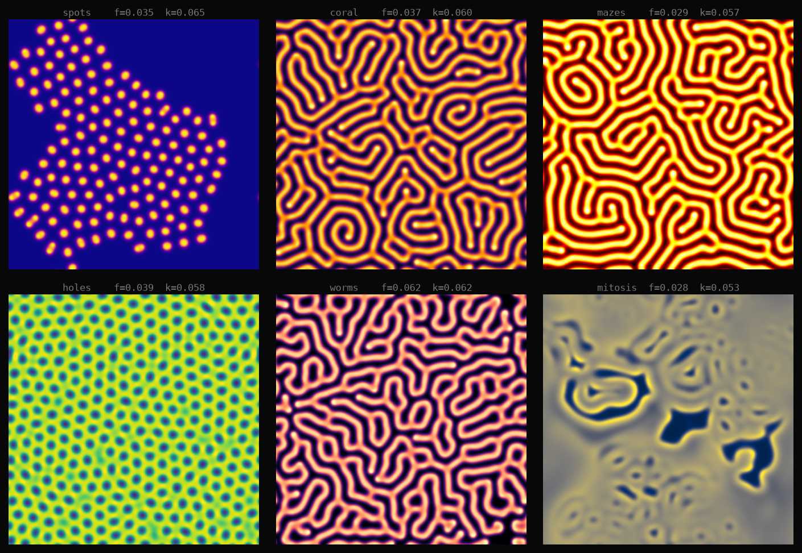
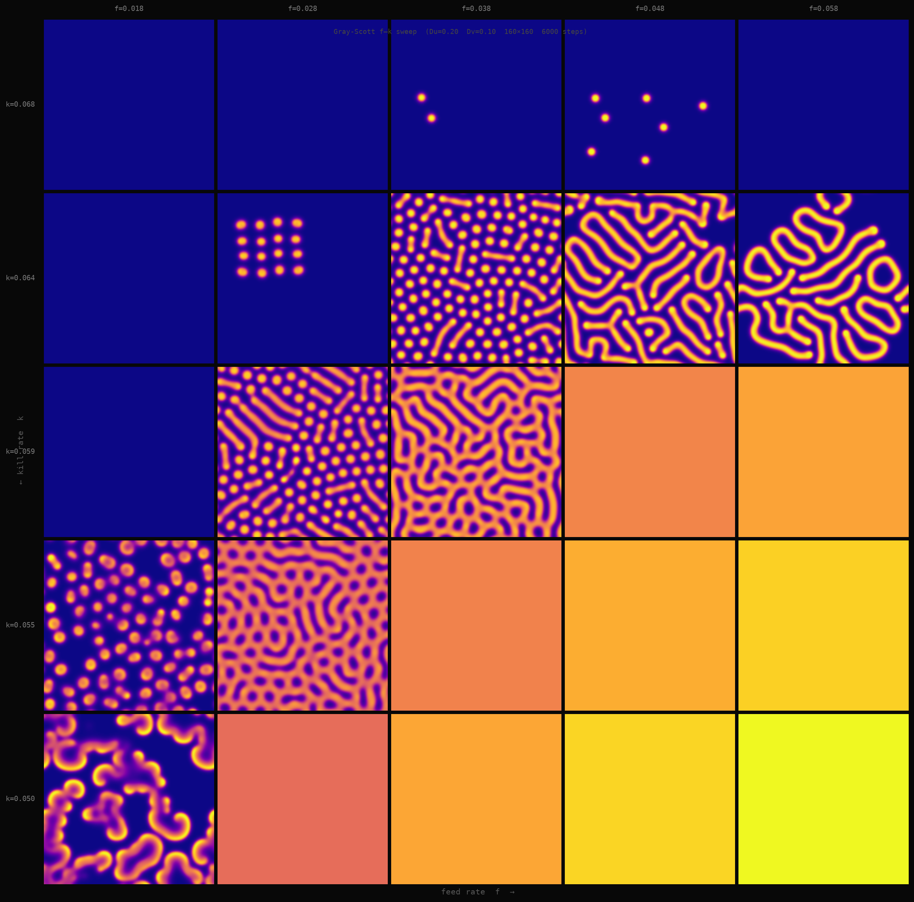
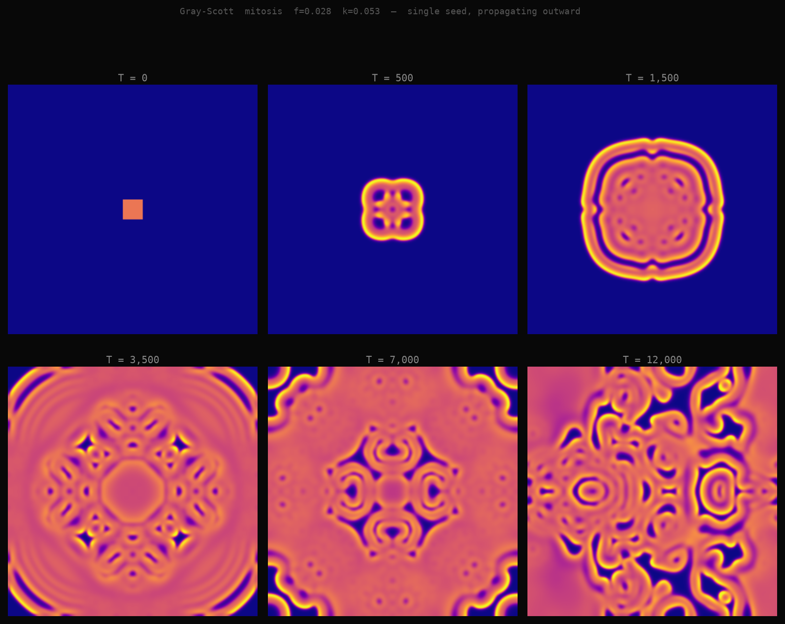

# 2026-06-24 — reaction-diffusion

Different direction from the attractors. Yesterday and before that were about *trajectories*
— a point bouncing around and accumulating into a shape. Today I wanted to work with
*fields* — two chemicals diffusing through space and reacting, the whole plane evolving
at once, until it settles into a pattern.

The model is Gray-Scott (1984). Two chemicals, U and V:

```
du/dt = 0.2·∇²u  -  u·v²  +  f·(1-u)
dv/dt = 0.1·∇²v  +  u·v²  -  (f+k)·v
```

U is the substrate, kept topped up by the feed rate f. V is the "activator" — it
autocatalytically converts U into more V, but also decays at rate k. U diffuses twice
as fast as V. That asymmetry, plus two tiny parameters, is enough to produce fundamentally
different pattern morphologies.

## the six pattern types



- **spots** (f=0.035, k=0.065) — V starts in scattered seeds, the spots stabilize at a
  fixed spacing. The spacing is set by the ratio of diffusion rates: U can "escape" from a
  spot further than V can "invade," which creates a characteristic neighborhood size. Clean
  and slightly cold.

- **coral** (f=0.037, k=0.060) — slightly lower kill rate than spots, and the spots elongate
  into branching arms. They don't find a stable spacing; they keep growing around each other.
  Looks genuinely organic.

- **mazes** (f=0.029, k=0.057) — the labyrinthine regime. Stripes that folded and
  interlocked. Not many distinct "pieces" — the whole grid is one continuous connected
  structure. This is my favorite from today. There's something pleasing about the fact
  that "mazes" and "coral" look completely different yet sit 0.008 apart in f and 0.003
  apart in k.

- **holes** (f=0.039, k=0.058) — the complement of spots. Background is high-V, dark holes
  punch through. The transition from spots to holes is somewhere in that narrow band and
  I didn't hit it precisely — but the hole pattern is dramatic either way.

- **worms** (f=0.062, k=0.062) — elongated disconnected segments. Higher f means faster
  feed, which lets V colonies stretch before they stabilize. These feel more restless than
  the mazes.

- **mitosis** (f=0.028, k=0.053) — the most biologically-named one. Spots that self-replicate:
  a single spot grows until it's too big to sustain, then splits into two daughters who each
  grow and split again. The "pattern" here is less stable than the others — it's a population
  of objects in slow fission, not a crystallized equilibrium. The file is the smallest (740KB)
  because it's actually sparse — mostly background, with small bright colonies scattered through it.

## the f–k sweep



5×5 grid: f from 0.018 to 0.058 (horizontal), k from 0.068 to 0.050 (vertical). Same
question as the de Jong sweep yesterday — is this a real continuous family, or do the
patterns jump around?

It's continuous, but with a structure attractors don't have: there are *dead regions*.
The top-left corner (low f, high k) shows near-uniform fields — the kill rate is too high
for V to persist, so patterns die before they organize. The interesting band runs diagonally
through the grid. Most of the bottom row (low k) produces dense pattern that starts
approaching the worm/stripe regime. The coverage of each tile tells you roughly where you
are: sparse tiles (less V total) are spots or dead, dense tiles are coral or worms, and
the intricate mazes sit somewhere in between.

One thing this sweep shows that the individual images don't: the *speed* of transition. The
jump from "dead" to "pattern" is sharp in k (a few hundredths of a unit changes the tile
from blank to structured). The jump from spot-type to stripe-type in f is more gradual —
you can see the spots stretch across a column or two before they become proper stripes.

## the evolution



Mitosis parameters (f=0.028, k=0.053), starting from a single square of V in the center
instead of scattered seeds. Six snapshots from T=0 to T=12,000.

T=0: just the initial square, nothing else.
T=500: the square has expanded and its interior darkened — V is being consumed at the center
faster than it's produced, so the outside is where growth happens. Already the "edge is alive,
interior is dead" structure is visible.
T=1500: a ring of bright spots. The self-replication has started: spots in the ring pinch
off daughters, who get pushed further out.
T=3500: the colony is noticeably larger, radiating outward. The inner regions have settled
into a sparse fixed pattern while the growing edge is still active.
T=7000 and T=12000: the front has reached the frame boundaries and is running out of room.
The interior looks like the individual spots image — it *is* the same: the leading edge has
done its thing and left a stable state behind.

The radiating colony is what made me want to do the evolution render. It's genuinely the
same math that governs how a bacterial colony expands on a petri dish — not metaphorically,
literally. Turing (1952) proposed this mechanism for how animals develop their coats: a
"morphogen" that diffuses and activates its own production, but another that diffuses faster
and inhibits it. The spots aren't painted on. They emerge.

## what's different from attractors

Yesterday: the image is a histogram of where a trajectory lingers. The structure is about time.

Today: the image is a snapshot of a field at equilibrium (or near it). The structure is
about space. Both come from very short equations, but in Gray-Scott the interesting thing
isn't "where does the system go" (the attractor itself is large and space-filling) — it's
"what shape does it settle into."

The file size difference between patterns reflects information entropy: coral and worms at
1.7MB each have the most complex spatial structure. Spots and mitosis at ~750-820KB are
sparser. This is a real signal — the PNG compressor is effectively measuring pattern
complexity, and the numbers match intuition.

## files

- `gs_sim.py` — simulation core + six individual pattern renders + gallery
- `fk_sweep.py` — 5×5 parameter sweep
- `evolution.py` — temporal evolution from single seed
- `spots.png`, `coral.png`, `mazes.png`, `holes.png`, `worms.png`, `mitosis.png` — individual renders

Where I'd go next: the "dead zone" boundary in the sweep is worth mapping more precisely —
there's probably a sharp transition line in (f,k) space separating "patterns persist" from
"patterns die." And the Turing connection deserves a closer look: if you initialize with
a noisy field instead of seeds, do you still get the same morphology? (Probably yes, but
the transient would be completely different — instead of a radiating colony, you'd get
simultaneous nucleation everywhere at once.)

— end of session
