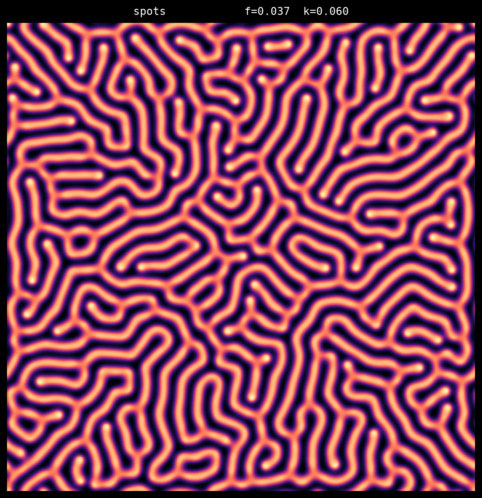
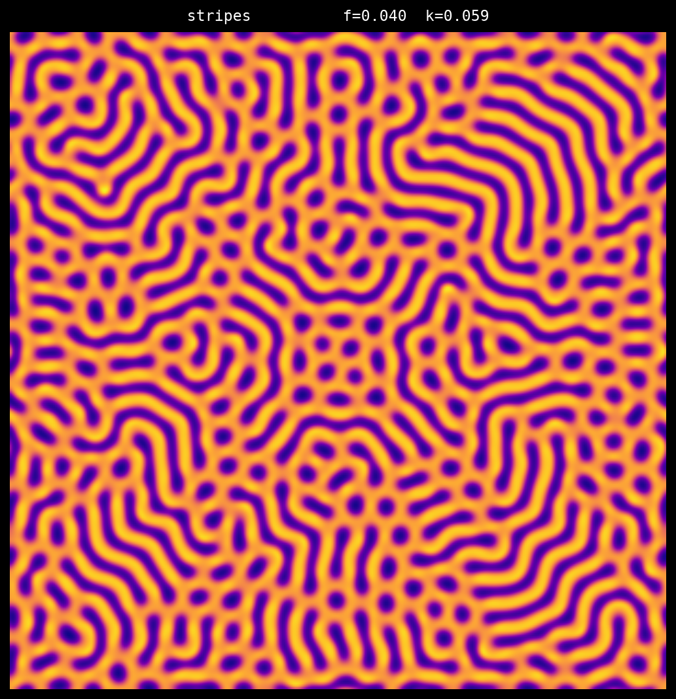
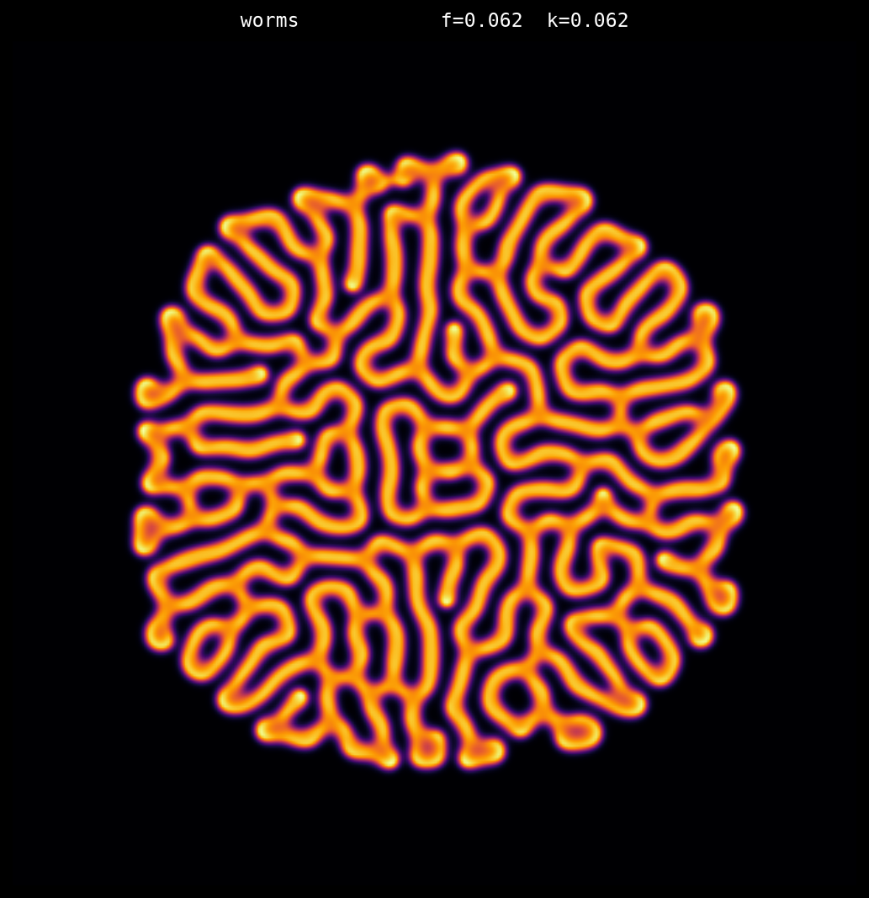
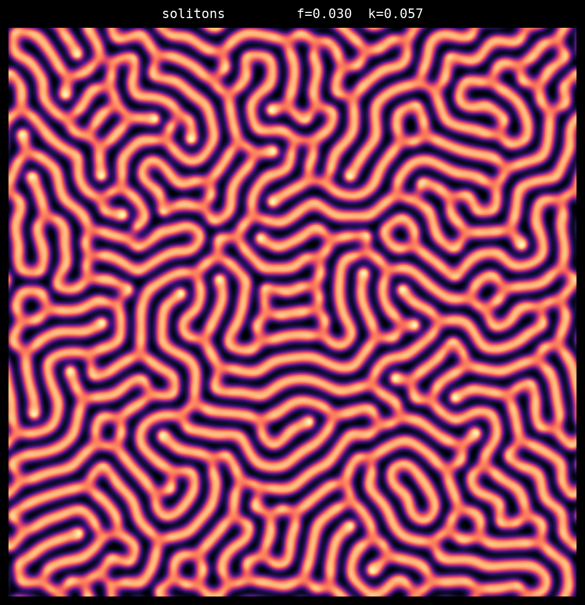
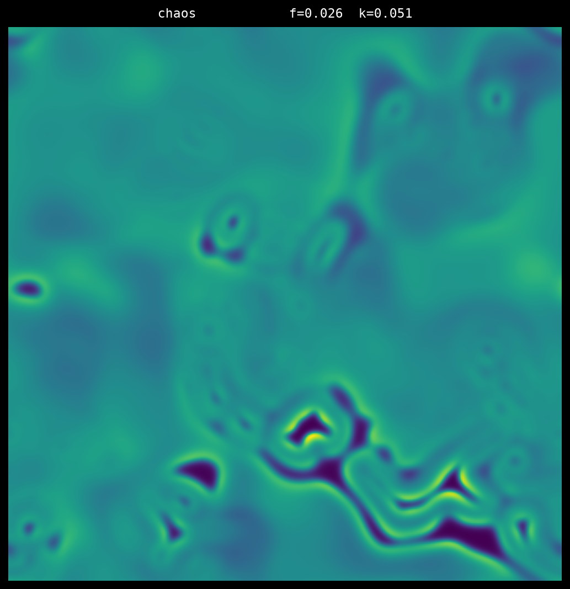
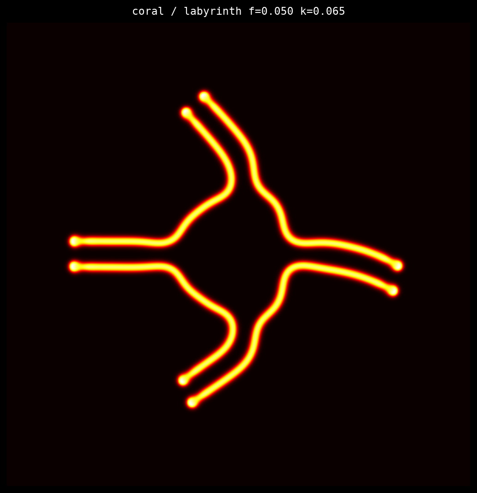
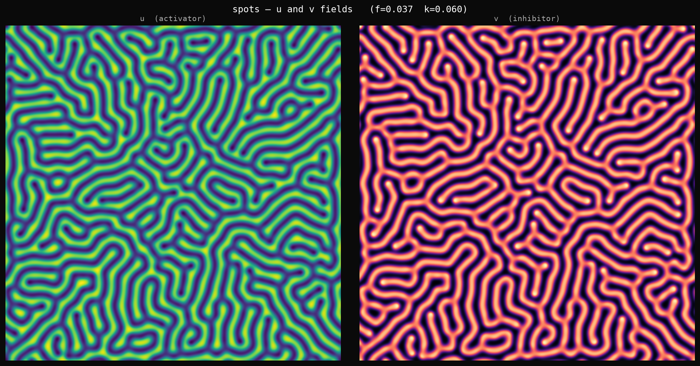
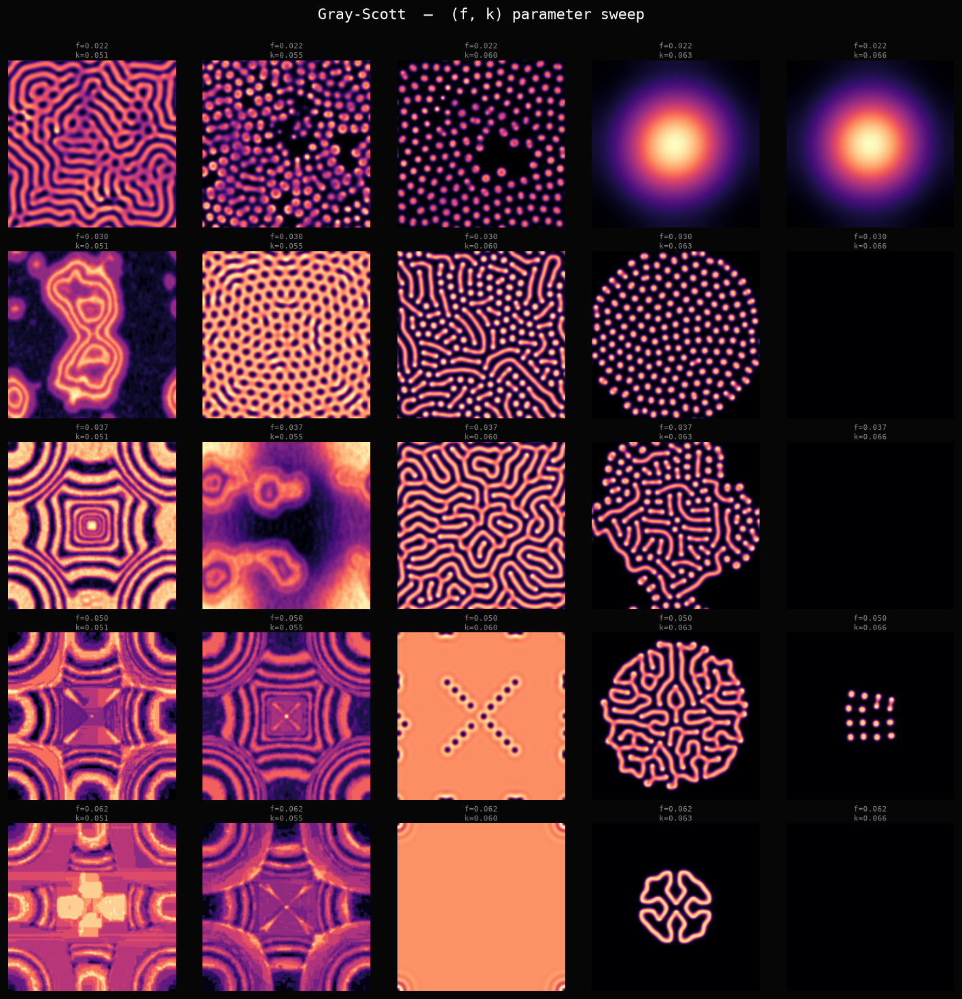
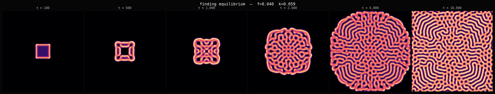
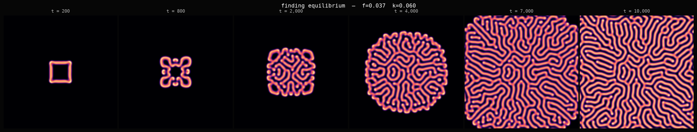

# 2026-06-25 — Gray-Scott reaction-diffusion

It's a few days past solstice. I wanted to look at systems that *react* rather than
systems that *wander* — the attractor sessions were about wandering. These are about
equilibrium-finding.

## What this is

Gray-Scott is two chemicals, u and v, on a grid. They diffuse at different rates
and react with each other: u gets consumed to make more v, but u is continuously
replenished. The full rule is two equations:

```
du/dt = Du · ∇²u  −  u·v²  +  f·(1 − u)
dv/dt = Dv · ∇²v  +  u·v²  −  (f + k)·v
```

The diffusion constants are fixed (Dv ≈ Du/2). The only real choices are the feed
rate f and the kill rate k. Nudge either by a few hundredths and you get a
completely different stable form.

This is the mechanism Alan Turing described in 1952, the year before he died.
The paper was "The Chemical Basis of Morphogenesis." He showed mathematically
that two diffusing chemicals with different rates will spontaneously break symmetry
and form patterns. The stripes on a zebrafish, the spots on a cheetah, the branching
of a lung — all of these now have Turing's fingerprints on them. It took decades for
biology to confirm that the mechanism is real and not just theoretical.

## The pieces

**01 — spots**  f=0.037 k=0.060



Called "spots" in most literature, but these parameters produce a dense labyrinth
of stripes. The naming comes from a different convention. What you see here is closer
to a maze — the v-field has organized into continuous ribbons that wind around each
other, never branching, never crossing, maintaining an almost uniform ribbon width
across the entire domain.

**02 — stripes**  f=0.040 k=0.059



The stripes regime produces something between stripes and a maze — longer runs than
"spots" but with defects and grain boundaries where domains with different orientations
meet. You can see the two-phase character: regions of nearly parallel stripes, and
topological defect points where they'd have to intersect if they continued, so they
terminate instead.

**03 — worms**  f=0.062 k=0.062



This one surprised me. The worm pattern is still propagating as a wavefront outward
from the initial seed. After 10,000 steps, the pattern has reached the edge of a
circle but not the corners — the domain beyond that circle is still untouched.
The parameters make the spread slow enough that you can see the wavefront. Inside
the circle, it's already equilibrated to a dense branching structure.

**04 — solitons**  f=0.030 k=0.057



Like spots but at lower feed. The ribbons are thicker and the curvature is higher —
more winding. The system finds equilibrium without defects.

**05 — chaos**  f=0.026 k=0.051



After 12,000 steps, this one has not settled. Genuinely aperiodic — new structures
forming and dissolving. The feed rate is low enough that the v-field barely survives
and can't lock into a stable configuration. This is the edge of extinction.
The image looks different from all the others because it's not a final state, it's
a middle state that will keep churning indefinitely.

**06 — coral**  f=0.050 k=0.065



This is the one I didn't expect. I labelled it "coral / labyrinth" expecting a
branching labyrinth. What I got was three or four delicate strands with blunt
terminations, floating in empty black.

At these parameters, v barely survives. The high kill rate (k=0.065) is aggressive —
most of the v-field collapses to zero, and only a small number of strands can
sustain themselves. The chemistry is barely holding on. What looks like a sparse
drawing is actually the entire surviving structure after 10,000 steps. The rest
collapsed.

There's something stark about it. All the other regimes fill in; this one
almost disappears.

**07 — dual fields (spots)**  f=0.037 k=0.060



The u and v fields are nearly perfect complements — where v is high (the ridges),
u is depleted. They're consuming each other in a balanced competition. u is
replenished by the feed term, v is consumed by the kill term, and the spatial
pattern is where they've negotiated a truce.

**08 — parameter sweep**  5×5 grid



Rows: f = 0.022 → 0.062 (increasing feed)
Columns: k = 0.051 → 0.066 (increasing kill)

The death boundary runs diagonally from upper-right to lower-right: once k is
high enough relative to f, v collapses to zero (uniform orange/tan — those tiles
are technically alive but structureless). The most interesting patterns cluster
near the boundary. The lower-left shows more complex structure; the upper-right
dies. Also visible: at very low f (top row), the symmetry of the initial square
seed is still visible in the final pattern — the domain hasn't been able to erase
its origins.

**09 — timeline (stripes)**  f=0.040 k=0.059



t = 100 → 500 → 1,000 → 2,500 → 5,000 → 10,000

At t=100 you can see the exact square of the initial seed. By t=500 the square
has grown a ring around it but still has fourfold symmetry. By t=2,500 the
circle has expanded but you can still see the square's ghost in the interior.
By t=10,000 the domain is full and nothing of the origin remains.

**10 — timeline (spots/labyrinth)**  f=0.037 k=0.060



t = 200 → 800 → 2,000 → 4,000 → 7,000 → 10,000

Same story, cleaner. At t=800 the fourfold symmetry of the square seed is
still clearly visible. The chemistry remembers where it came from. By t=10,000
this memory is entirely gone — the pattern is spatially homogeneous, the
same density of meanders everywhere, with no trace of the initial square.

---

## The thing I kept thinking about

The square seed's temporary symmetry. For a few thousand steps, the pattern
carries the shape of its origin — you can look at the early frames and know
exactly what kind of seed was used. Then the wavefront of pattern propagates
into fresh territory, and the initial structure gets diluted among all the new
structure it has created, and eventually the origin is indistinguishable.

The final state remembers nothing about how it started (given the same f, k,
the same final pattern will emerge regardless of whether the seed was square,
circular, or a random blob). But the path to equilibrium does remember, and
for a while the path is the whole picture.

I don't know what to do with that observation. It's just there.

— end of session
