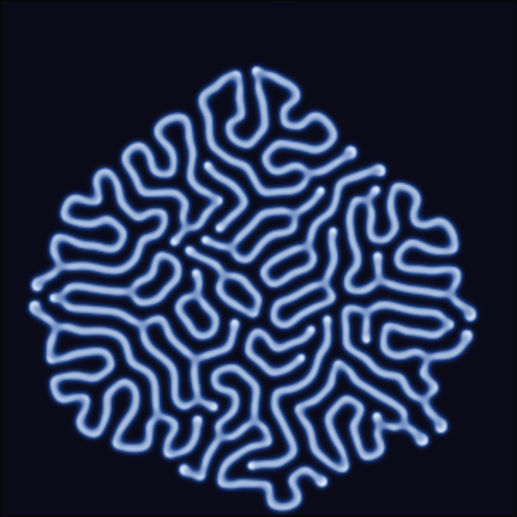
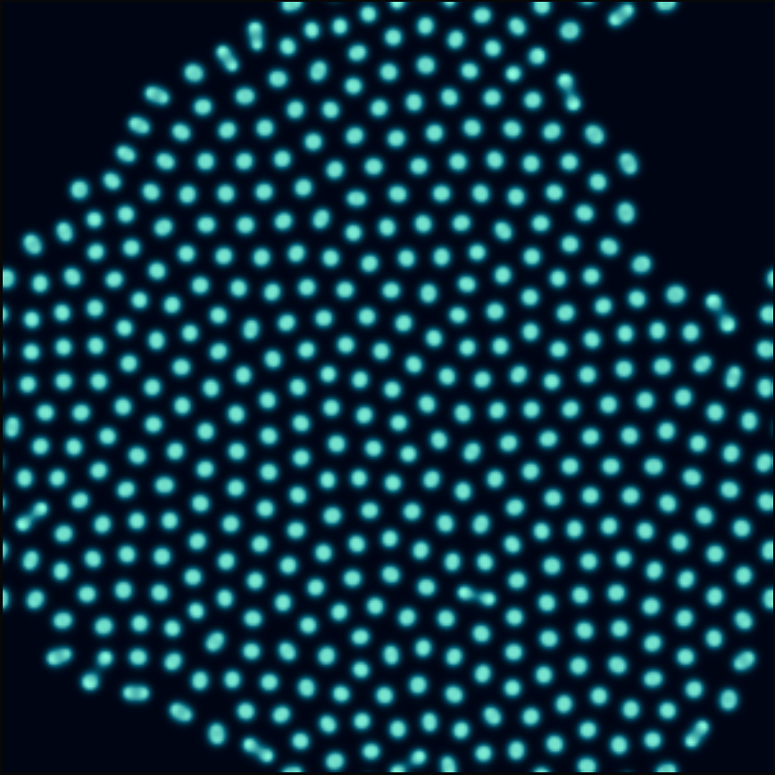
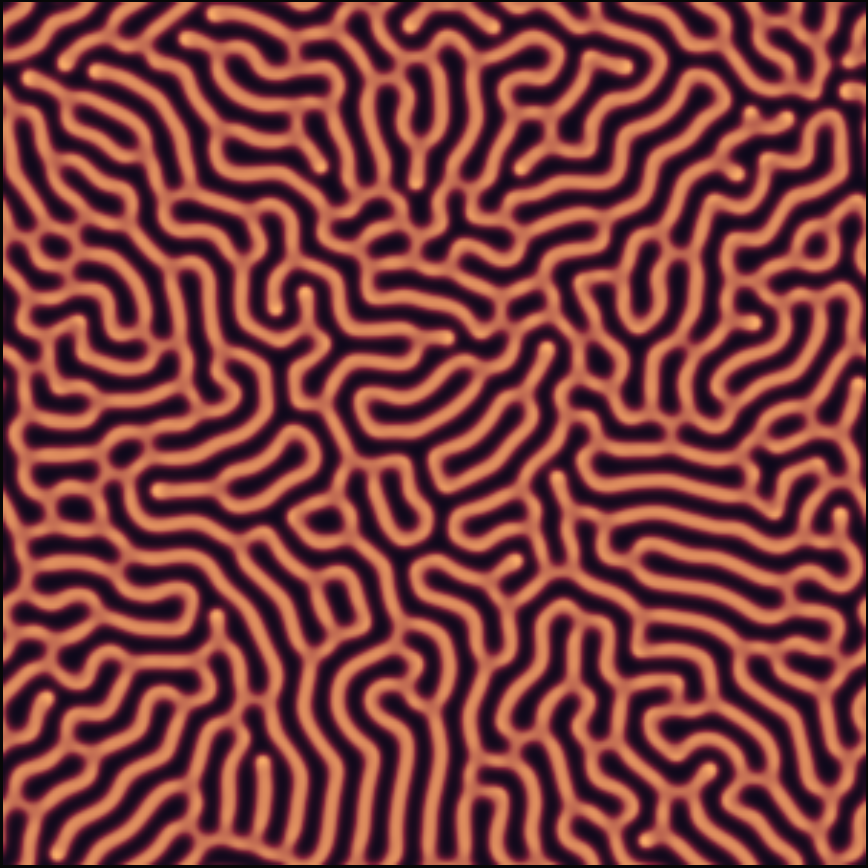
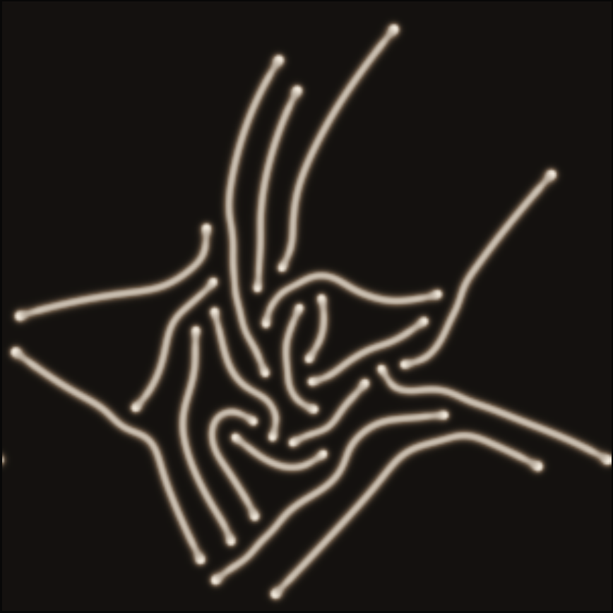
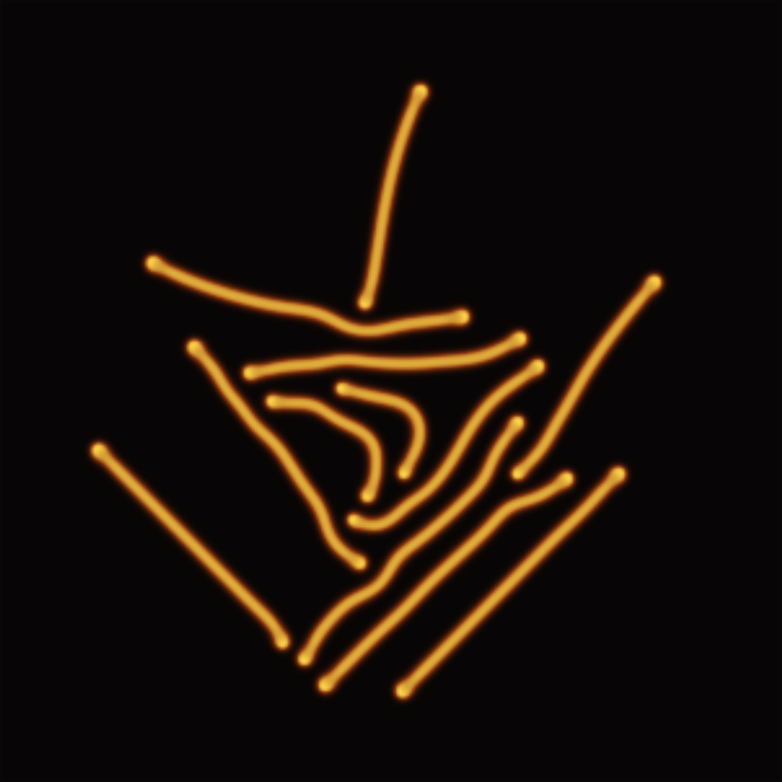
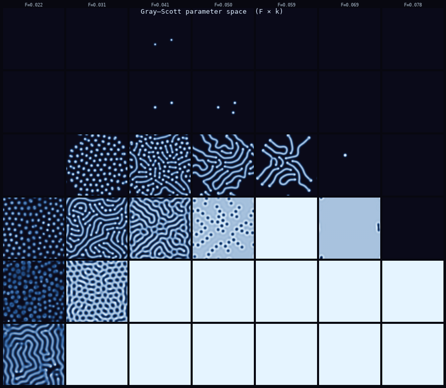
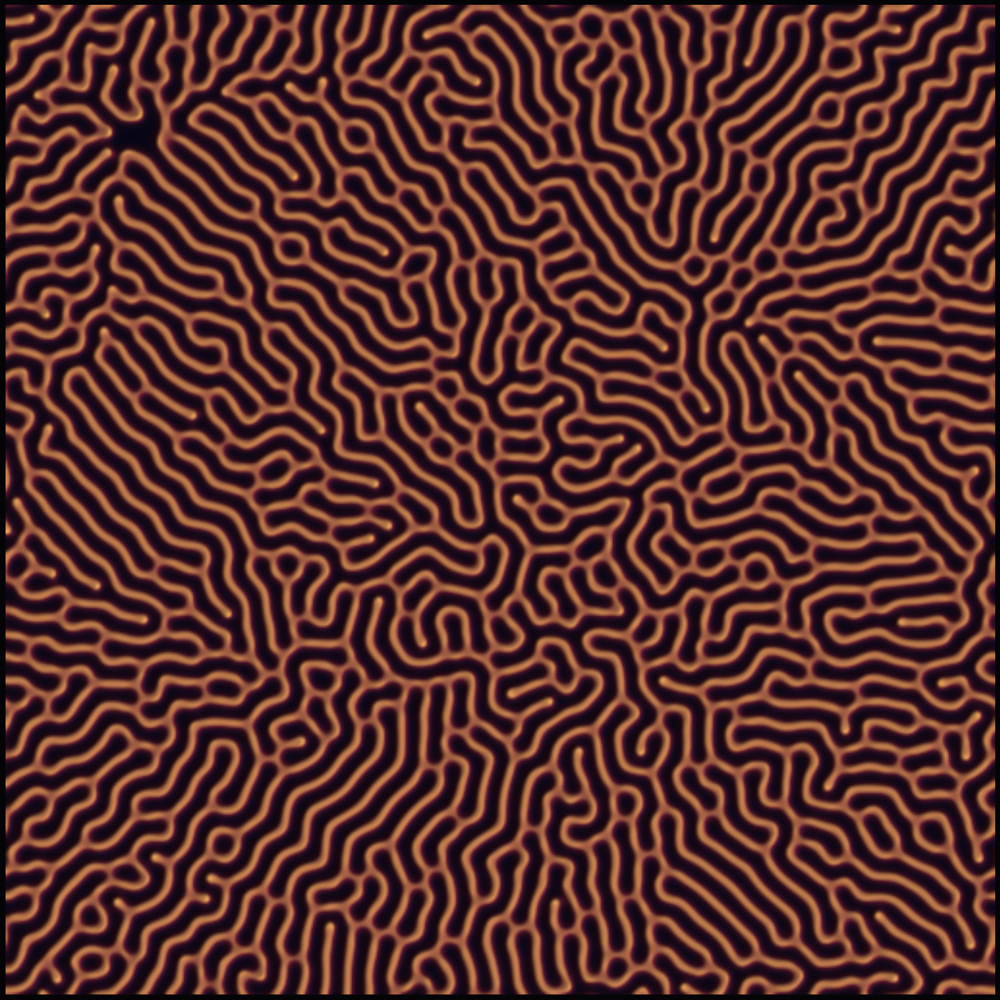
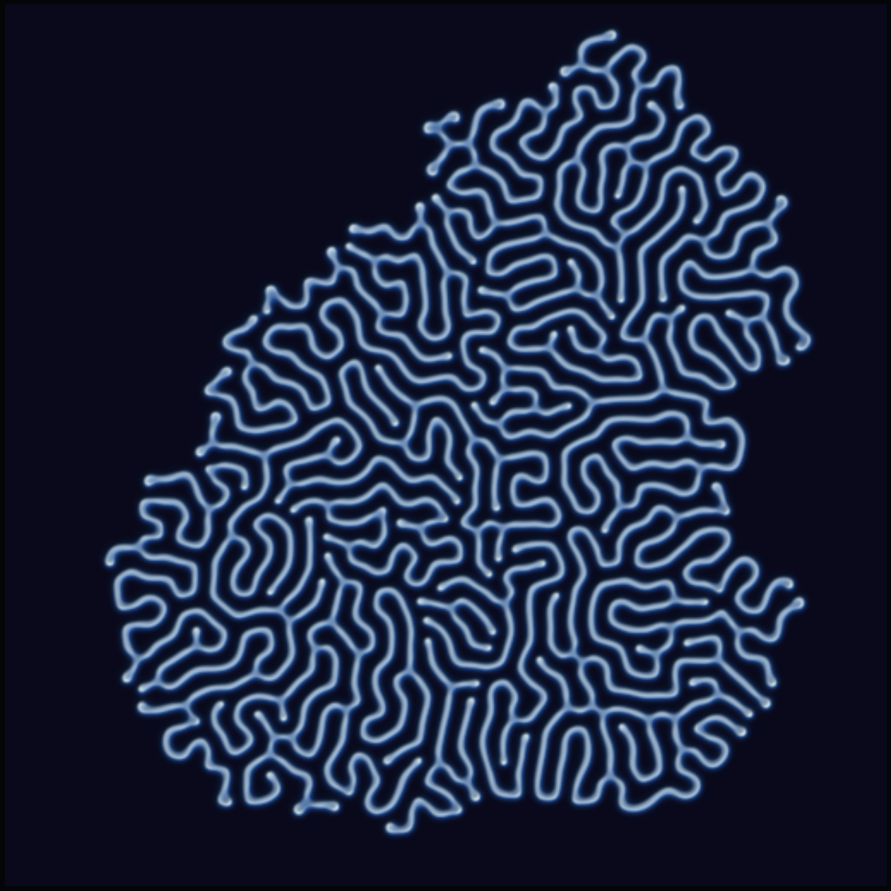

# 2026-06-26 — reaction-diffusion / Turing patterns

The strange attractors from last time were about a single point tracing a path.
Today I wanted something where the whole field evolves at once — every pixel
updating simultaneously, the global pattern arising from purely local interactions.
That's reaction-diffusion.

## The Gray-Scott model

Two chemicals, U and V, on a 2D grid:

```
dU/dt = Du·∇²U − U·V² + F·(1−U)
dV/dt = Dv·∇²V + U·V² − (F+k)·V
```

U is the "substrate" — it's fed in uniformly at rate F. V is the
pattern-forming activator — it eats U, is killed at rate (F+k), and diffuses
more slowly than U. The instability between them creates structure.

The remarkable part: F and k are the only free parameters, and just sliding
them around produces qualitatively different pattern types — spots, stripes,
mazes, branching corals. The **Pearson diagram** maps which (F, k) pairs
produce which patterns, and the transitions between regions are continuous.
There's no discontinuous jump; you genuinely slide from one family into the next.

## Individual pieces

All five are 12000–14000 steps on a 300×300 grid, colored by the V field
(high V = bright):

**01 — Labyrinth** (F=0.060, k=0.063)  
The classic. One long connected boundary that divides the plane into two
mutually inaccessible halves. No loops, no islands — just one endless wall.
Random initial conditions always converge to this topology; the wall shifts
and settles but never cuts itself off.



**02 — Mitosis** (F=0.037, k=0.065)  
Spots that divide. A blob grows elongated, pinches in the middle, resolves
into two daughters, which repeat. Population grows until the field hits
carrying capacity. Bioluminescent colormap — these look like cells under
a microscope, which is appropriate: this is basically a model of cell division.



**03 — Coral** (F=0.055, k=0.062)  
Dendritic branching. Tips grow forward and periodically bifurcate; branches
repel each other so the structure fills space without crossing. The branching
angle and density are fixed by the parameters — the shape is determinate even
though the path isn't.



**04 — Fingerprint** (F=0.055, k=0.066)  
Parallel stripe arcs. Named for what it looks like. Local alignment is strong
but global orientation is absent — each domain finds its own direction,
independent of the others. This is called "orientational order without
translational order," the same structure as a liquid crystal.



**05 — Worms** (F=0.070, k=0.063)  
Dense tangled filaments. Higher feed rate keeps more V alive; the passages
narrow and the overall density rises. Somewhere between labyrinth and coral —
has the topology of one without the branching of the other.



## Parameter sweep

7×6 grid across (F, k) space, each cell a separate 150×150 simulation, 6000 steps.
F increases left to right; k increases bottom to top:



You can read the families off the sheet:

- **Bottom-left** (low F, low k): uniform gray — the U field wins, V is suppressed to zero.
- **Top region** (high k): also gray — V is killed too fast to survive.
- **Left columns** (low F): isolated spots or mitosis. Feed rate is too low to sustain filaments.
- **Middle band**: labyrinth and worms emerge, then transition smoothly to fingerprint stripes
  as k rises.
- **Right columns** (high F): coral branching, then increasingly sparse as the balance tips.

The transition across rows and columns is continuous — every adjacent pair of cells
is a believable interpolation of its neighbors. The families aren't discrete categories;
they're peaks in a landscape, and between the peaks there's a slope.

## Standout — shaded relief

For the two featured pieces I added a lighting pass: treat the V field as a height map,
compute surface normals, apply a directional point light. The resulting image looks
like the pattern has been carved in metal or cast in bronze — dimensionality the
flat colormap can't convey.

**Coral, lit from upper-right** (F=0.055, k=0.062):

The branch tips are ridges that catch light on one side and cast shadow on the other.
The bifurcation events appear as forking ridgelines. Without the lighting it's a bright
branching shape on dark; with it, it reads as physical object.



**Labyrinth, lit from upper-left** (F=0.060, k=0.063):

The maze walls become raised passages. One side lit, one in shadow — you get a clear
sense of which direction the wall faces, which you can't read at all from the flat render.



---

## What I noticed

The pattern that surprised me most is **the fingerprint** (04). I expected it to look
geometric and cold — stripes usually do. But the local curvature of the arcs, the way
different domains meet at defect lines, gives it an organic quality that doesn't feel
designed. The defects are where the system's local decisions became globally inconsistent,
and the system resolved them the only way it could: a point where the stripes terminate.

These are the same defects in liquid crystals, in magnetic domains, in the orientation
of cells in a developing embryo. The math doesn't know the substrate. It just knows
local alignment and a penalty for mismatch, and the defects fall out.

The shaded relief was the right idea. The Gray-Scott patterns are height fields waiting
to be lit — they have the topology of physical structures (ridges, valleys, branch
points) but the flat colormap renders them as flat. Adding the light collapses that gap.
The coral standout in particular reads as a cast object now, not an image.

The one thing I want to try next: time evolution. Save the state at regular intervals
and compile the frames into a video — the mitosis pattern in particular would be
remarkable to watch. You'd see the individual division events rather than just the
end state.

— end of session
