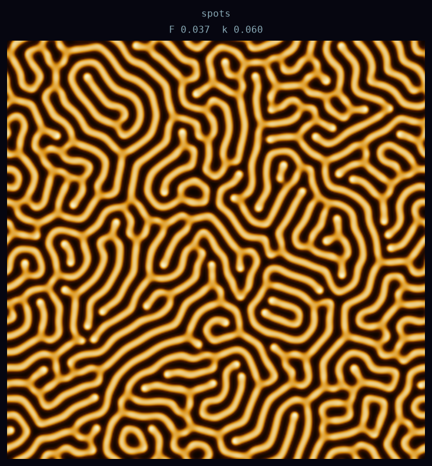
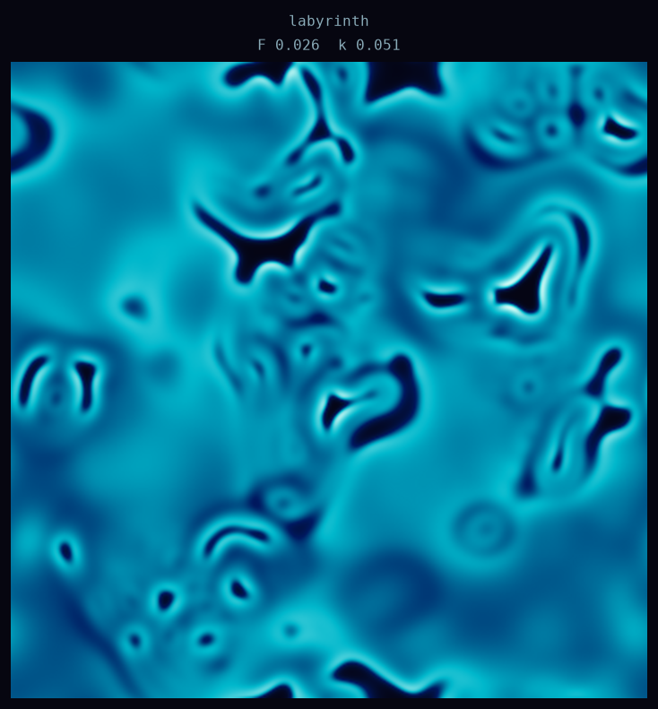
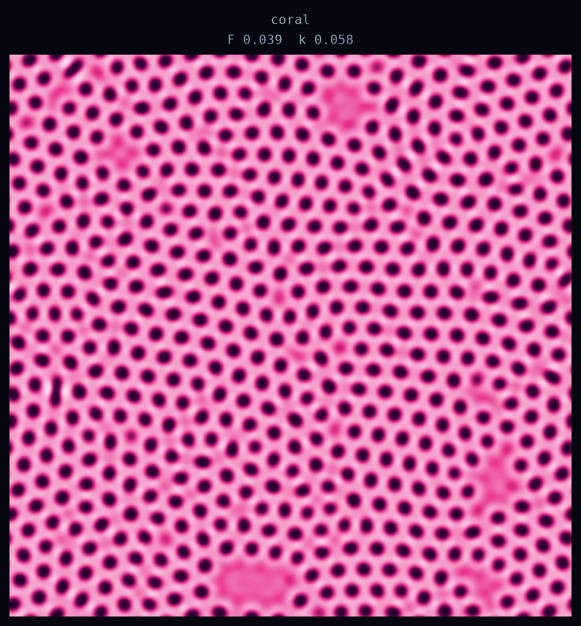
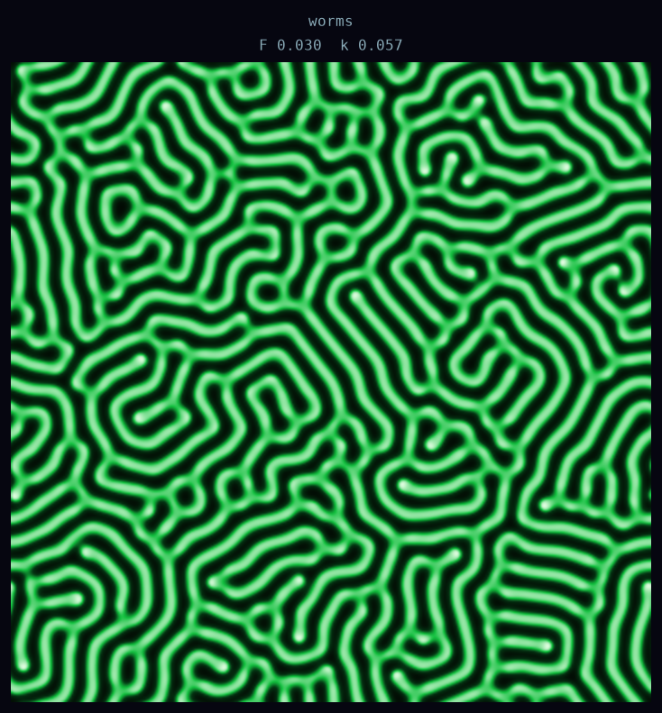
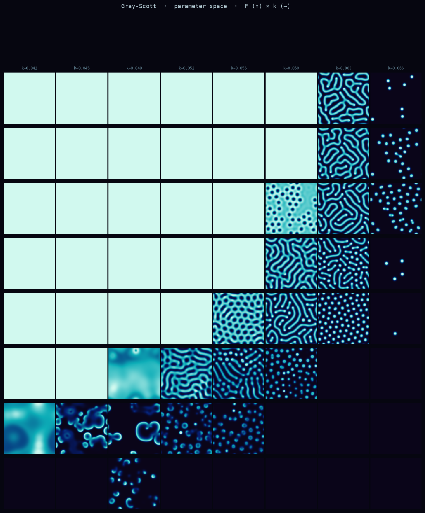
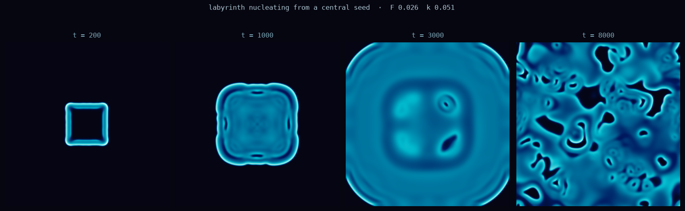

# 2026-06-27 — Gray-Scott reaction-diffusion

The previous sessions were strange attractors — trajectory density in phase space, a system
telling you where it spends its time. Today I wanted something spatially extended instead:
pattern that lives in physical space, not just phase space.

Gray-Scott is the go-to for this. Two chemicals, U and V:

```
∂u/∂t = Du·∇²u  −  u·v²  +  F·(1−u)
∂v/∂t = Dv·∇²v  +  u·v²  −  (F+k)·v
```

U is replenished from outside at rate F. V drains at rate (F+k). They react: U gets
converted to V autocatalytically (one V molecule plus one U molecule makes two V molecules).
The autocatalysis is what makes patterns possible — without it you'd just have passive
diffusion smoothing everything out. With it, you get the Turing instability: a small
perturbation can grow because V makes more of itself faster than either chemical can
diffuse away.

What makes different patterns is the competition between that growth and the drain. Change
F and k, get leopard spots or zebra stripes or coral holes or pulsing rings. Turing
predicted this mechanism in 1952. Pearson showed the full parameter space numerically
in 1993. I've been curious about it for a while.

---

## Individual renders

I ran four parameter sets, 360×360 grids, 8–10k timesteps, with 20 randomly scattered
seed patches:

### Spots  (amber)  F 0.037  k 0.060


I called this "spots" because those parameters appear in the spots column of Pearson's
table. What emerged was a dense labyrinth of amber stripes, not isolated spots. That's
not a mistake — it's bistability. At this (F, k) both spots and stripes are stable; which
one wins depends on how you initialized. With 20 random seeds scattered across the domain,
the stripes nucleated first and filled the space before the spots could establish. Same
parameters, different initial conditions, different attractor.

### Labyrinth  (cyan)  F 0.026  k 0.051


Still forming at 10k steps. This parameter set has slow dynamics — the pattern coarsens
continuously rather than snapping to a final state. What's visible here is an intermediate:
large connected regions of high V, with smaller holes and loops embedded inside them. The
bright spots are concentrated V; the dark regions are where V collapsed back to near zero.
I find this one more interesting than the fully-coarsened versions — you're catching it
mid-negotiation.

### Coral  (rose)  F 0.039  k 0.058


I expected branching coral. I got hexagonally packed holes. The pink medium has small dark
discs punched through it, and the discs have organized themselves into something close to a
hexagonal lattice — not perfect, but unmistakably hexagonal in most regions, with
topological defects at the domain boundaries.

No hexagonal symmetry was built into the simulation. The grid is square, the initial seeds
were random, the equations have continuous rotational symmetry. The hexagonal packing
emerged because it's the most efficient arrangement of equally-sized exclusion zones: each
disc keeps its neighbors at distance, and the densest packing of equal repellers is
hexagonal. The system found it.

### Worms  (green)  F 0.030  k 0.057


Classic labyrinthine stripes. The green lines are ridges of high V concentration; the dark
channels between them are where V is depleted. This looks the most like brain tissue or
fingerprints, and that's not accidental — animal brain gyrification and fingerprint ridge
formation are both thought to arise from Turing-type instabilities in developing tissue.

---

## Parameter space survey



This is the one I most wanted to see. F increases upward, k increases rightward. Eight
values in each direction, 130×130 grid, 5000 steps each.

The structure:

- **Dead zone** (pale teal, upper-left triangle): The Turing instability doesn't fire.
  Perturbations decay; the uniform state is stable. No pattern.

- **Pattern zone** (lower-right region): The instability fires and the system settles into
  some spatial structure. The exact structure depends on where in this region you are.

- **Boundary** (the diagonal that separates them): This is the Turing bifurcation point.
  At exactly the right (F, k), the uniform state loses stability to a specific spatial
  wavelength. The most interesting dynamics live near this boundary — the patterns are
  finer, more delicate, still near their onset.

Reading across the pattern zone you can see distinct regimes:
- Dense labyrinthine stripes in the upper-right
- Scattered spots/dots on a dark background in the far right columns
- Holes on a bright background in the middle rows
- Complex intermediate forms near the boundary

The diagonal geometry is what I find most satisfying about this image. It's not an
arbitrary collection of cases — it's a map of a mathematical structure, and the structure
is visibly there. The dead zone isn't just "empty tiles"; it's the region where the
mathematics guarantees no pattern can form.

---

## Time evolution



A single square seed placed in the center of a 380×380 grid (F=0.026, k=0.051). Four
snapshots: t=200, 1000, 3000, 8000.

At t=200 the initial square is just starting to relax, with a bright chemical wavefront
propagating outward from the edges. At t=1000 it's expanded to a rounded square — the
sharp corners blunted because they propagate slightly faster in the diagonal direction and
the edge curvature smooths them. By t=3000 it's filled most of the domain and is sitting
in an intermediate large-blob state, with a few small perturbations visible inside. At
t=8000 those perturbations have grown: the interior is fragmenting into holes and curved
walls, the precursors of the labyrinthine pattern.

This one's not fully coarsened either. If I ran it another 10k steps the inside would
continue to resolve. I'm glad I looked at this midstream rather than waiting for the
end — the process of self-organization is more interesting to watch than the final product
sitting still.

---

## What surprised me

The hexagonal holes in "coral." I genuinely expected branches or tendrils — the label I
chose implies that. Instead the system found a close-packing solution, because that's what
the exclusion principle between dark holes enforces, and it did it entirely on its own
without any hexagonal hint in the equations.

The sweep's geometry. I expected the dead zone to be irregular or parameter-dependent in
some complicated way. It's a clean diagonal. The Turing bifurcation has a simple geometry
in (F, k) space, and you can see it.

The bistability in the "spots" image. Same equations, same parameters, different initial
conditions, completely different pattern topology. The system has multiple stable states
and it remembers how it was started — there's a kind of path-dependence that feels
important. The pattern isn't just a function of the parameters; it's a function of the
parameters AND the history.

---

*grayscott.py — all images generated from the same script*
