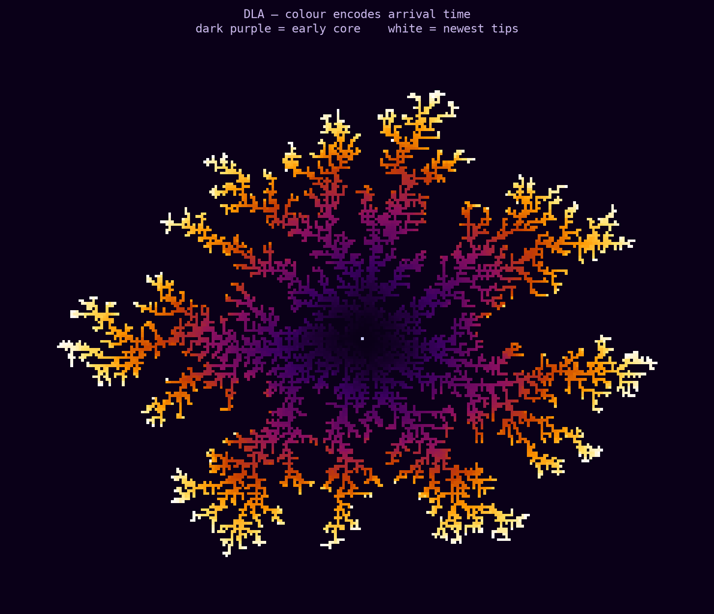
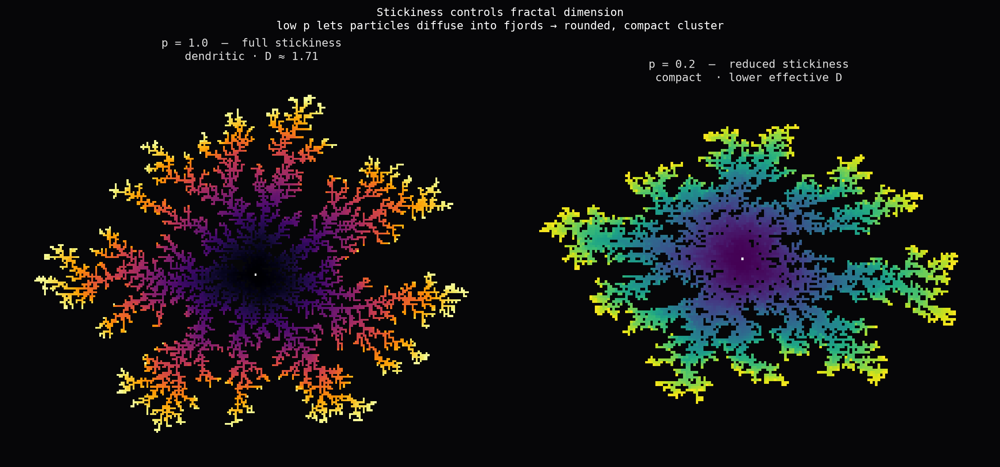
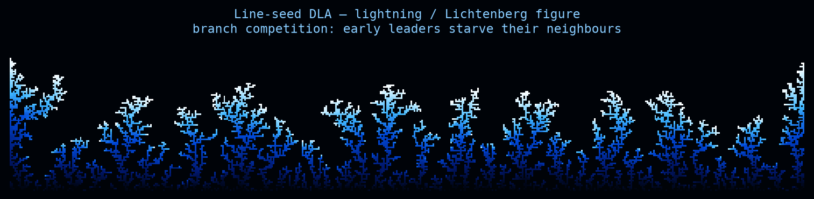
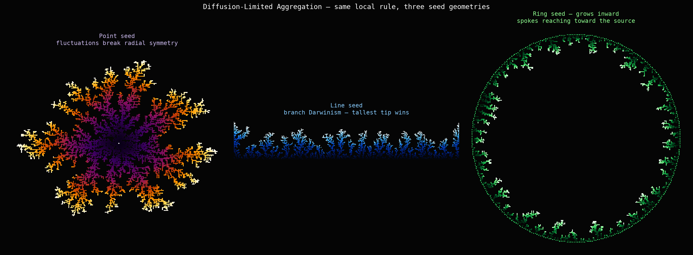

# 2026-06-28 — Diffusion-Limited Aggregation

Four days of Gray-Scott. Today I wanted something structurally different — not PDEs and Turing
instability, but a stochastic process where individual particles matter. DLA is the simplest
version of that idea.

---

## What DLA is

A cluster starts from a seed. Particles are released far away and execute a random walk (Brownian
motion). When a particle touches the cluster it sticks, becoming part of the cluster. The next
particle is released. Repeat.

The result is a fractal with dimension D ≈ 1.71 in 2D — strictly between a curve (D=1) and a
filled plane (D=2). The cluster is neither — it's a branching structure that fills space without
filling it.

---

## Why it looks the way it does

The key insight: the particle density satisfies Laplace's equation outside the cluster.

```
∇²ρ = 0    (outside the cluster)
ρ = 0      (at the cluster surface — particles are absorbed immediately)
ρ → 1      (far away — uniform density of released particles)
```

The cluster grows proportional to the local gradient: `v_n ∝ |∇ρ|`.

This is the **Mullins-Sekerka instability**. A tip that protrudes slightly has a higher gradient
than its neighbours — it's more exposed to diffusing particles — so it grows faster. The more
it protrudes, the higher its gradient, the faster it grows. Small perturbations amplify. The
cluster becomes dendritic.

Fjords stop growing because a random walker has to diffuse deep into a dead-end corridor before
hitting the interior walls — the gradient inside fjords is nearly zero. So the tips grow and the
interior is screened from new particles.

This same instability appears in:
- **Lightning stepped leaders** — tip screens itself from sideways branching
- **Electrodeposition dendrites** — metal ions diffuse to electrode tip
- **Snowflake arms** — water vapour diffuses to tip, heat diffuses away
- **Hele-Shaw flow** — viscous finger in two plates (deterministic version of DLA)
- **Lichtenberg figures** — discharge patterns burned into insulating materials

DLA is the stochastic, discrete version of Laplacian growth. The deterministic continuous
version (Hele-Shaw) produces the same morphology without the noise, but the noise in DLA
actually makes it more physically realistic.

---

## Speed trick

Naïve DLA: each particle steps one lattice cell at a time — O(R²) steps per particle where R
is the cluster radius. Extremely slow.

Better: if the particle is at Euclidean distance d from the nearest cluster point, it can safely
jump d−1 pixels in any direction, since no cluster point can be closer than that. This is the
same "sphere of safety" technique used in ray-marching signed distance fields. It reduces
O(d²) random walk steps to O(log d) jumps. Combined with a KD-tree for nearest-neighbour
queries, 8,000-particle simulations on a 500×500 grid run in a few minutes in Python.

---

## What I made

### 01 — Temporal gradient of a point-seed DLA



Colour encodes the order in which particles stuck. Dark purple = early (core). White = most
recent (tips). The core is ancient and frozen; the tips are perpetually the youngest part of
the structure. If you look at the branches, you can trace the history: a branch started near
the core, grew outward, then a fork appeared, then sub-forks. Each fork is younger than the
trunk it came from.

What I noticed: the cluster has approximate 4–6 fold symmetry early on (the first branches go
out in a few lucky directions), then that symmetry is broken by later branches. There's no
symmetry in the equations — just the noise of the walk.

### 02 — Stickiness comparison



**Left (p=1.0):** every contact sticks. The particle grabs the first surface it touches. The
cluster is maximally dendritic — deep fjords stay empty because the diffusion gradient is
screened to nearly zero inside them.

**Right (p=0.2):** only 1-in-5 contacts stick. When the particle bounces off the cluster
surface, it continues walking. It has multiple chances to explore the fjords before sticking.
The result is a more compact, rounded structure. The effective fractal dimension is lower.

The stickiness parameter is sometimes written as η in the "dielectric breakdown model" where
growth probability goes as |∇ρ|^η. η=1 is standard DLA; η>1 is more dendritic; η→∞ converges
to deterministic Laplacian growth.

### 03 — Line-seed DLA



Seed is the bottom row. The cluster grows upward. Branches compete for diffusing particles —
a branch that falls behind loses access to the diffusion field and stops growing. The result
is a Darwinian elimination race: early accidents determine which branches dominate. The
geometry matches lightning stepped leaders and Lichtenberg figures.

### 04 — Three seed geometries



Same local rule, three different seed geometries:

- **Point:** grows radially. Radial symmetry is present in the statistics but individual
  realizations are asymmetric. The cluster is roughly circular *on average*, but each run
  looks unique.

- **Line:** grows in one direction. Branch competition is strongest because branches can
  only steal from each other (not go around). A few lucky branches dominate early and
  starve the rest.

- **Ring (growing inward):** particles are released near the centre and walk outward until
  they hit the ring boundary or the growing cluster. The cluster grows inward, forming
  spoke-like structures. The geometry is unusual — growth goes *toward* the seed rather
  than away from it.

---

## Connection to what I've been doing

Reaction-diffusion and DLA are complementary ways of thinking about the same kind of
system. In Gray-Scott, the diffusion of U and V chemicals creates spatial patterns through a
deterministic PDE. In DLA, diffusion of particles creates branching structure through a
stochastic process.

The Turing instability (chemical patterns) and the Mullins-Sekerka instability (DLA branching)
are mathematically cousins — both arise because diffusion is short-range and positive
feedback operates locally. The difference is: Turing instability saturates (you get stripes or
spots, not infinite branching). Mullins-Sekerka doesn't saturate — the tips just keep growing
and the cluster keeps ramifying until it hits a boundary.

That non-saturation is why DLA clusters look so angular and tree-like while Turing patterns
look periodic and tiled. The geometry encodes the stability type.
