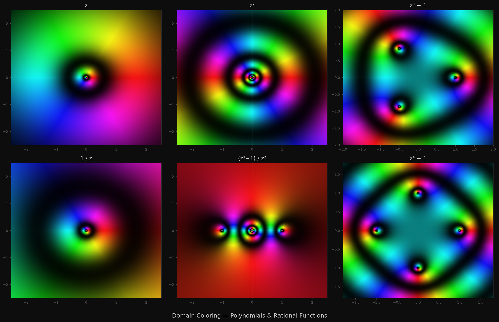
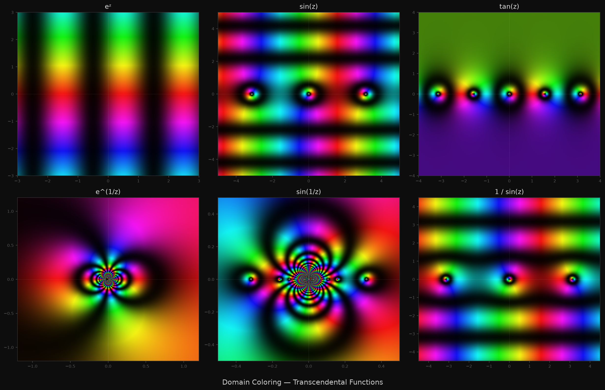
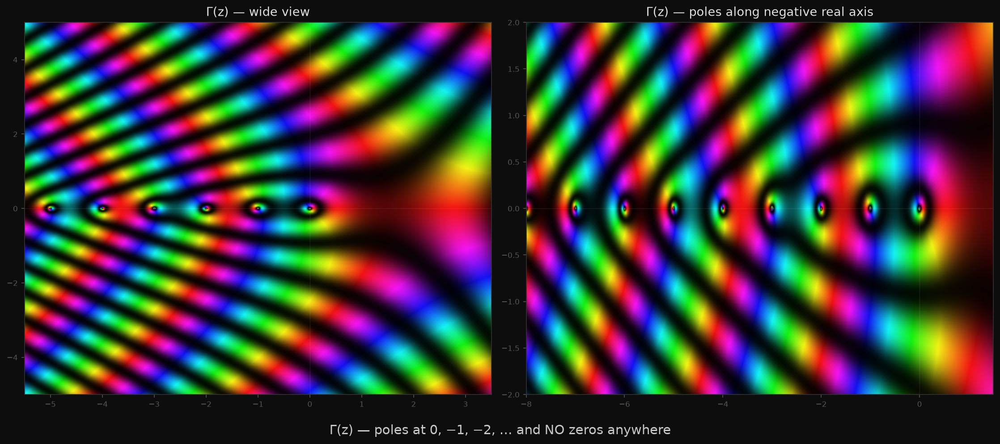
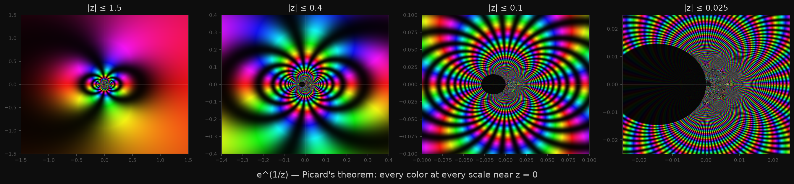
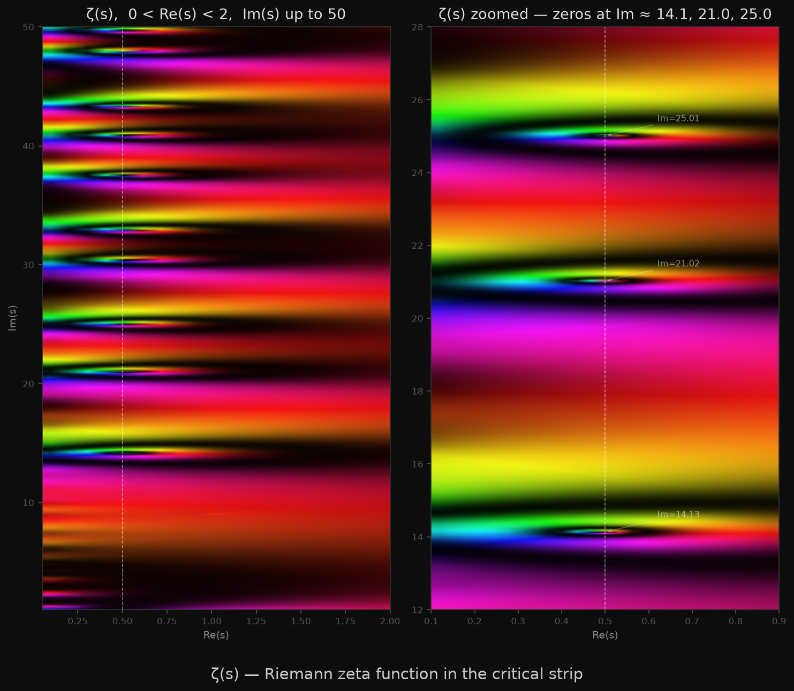

# 2026-06-29 — Domain Coloring of Complex Functions

Four days of Gray-Scott reaction-diffusion. Time for something different.

Domain coloring is a way to visualize complex-valued functions f: ℂ → ℂ. The input is
a point z = x + iy in the complex plane; the output is another complex number f(z). You
can't graph this the way you'd graph a real function (that would need 4D). Instead, you
color each point z by the value f(z): hue encodes the argument (angle) of f(z), and
brightness encodes the magnitude.

The specific scheme here — following Elias Wegert — makes magnitude visible through
periodic brightness oscillations: one light-dark cycle per factor of e in |f(z)|. This
creates concentric rings around zeros and poles, and makes winding numbers countable by eye.

**Color key:**
- East (positive real axis): red
- North (positive imaginary): yellow-green
- West (negative real): cyan
- South (negative imaginary): blue-violet
- Black = zero (f(z) → 0)
- White = pole (f(z) → ∞)
- Winding number = number of full color cycles around a point

---

## Figure 1 — Polynomials & Rational Functions

**z** (top left): one complete color cycle going counterclockwise around the origin. The
brightness rings are evenly spaced — magnitude grows linearly outward. The single zero at
z=0 is visible as a small dark region where all six colors converge to a point.

**z²** (top middle): two full color cycles around the origin. The zero at z=0 has order 2.
The two cycles are visible as two complete rainbows meeting at the center. This is the
definition of winding number made visual: walk a small circle around the zero,
count how many times the color completes a revolution — that's the order.

**z³ − 1** (top right): three zeros, one at each cube root of unity. They appear as black
points equally spaced around the unit circle at 0°, 120°, 240°. Each has winding number
+1 (order 1). The image has three-fold rotational symmetry — a direct consequence of the
three-fold symmetry of the equation z³ = 1.

**1/z** (bottom left): a single pole of order 1 at the origin. The color cycles in the
*opposite* direction (clockwise), because the argument of 1/z is −arg(z). The white center
marks where the function diverges. The rings compress inward, growing denser toward
the pole.

**(z²−1)/z²** (bottom middle): zeros at ±1 (order 1 each) and a double pole at z=0
(order 2). Count the color cycles near the origin: two revolutions clockwise — that's what
order-2 pole means. The zeros at ±1 are single black points with one counterclockwise
color cycle each. The simultaneous presence of zeros and poles in the same bounded region
is something only rational functions can do.

**z⁴ − 1** (bottom right): four zeros at the fourth roots of unity — 1, i, −1, −i. Four
black points, perfectly arranged in a cross. The fourfold symmetry of the image reflects
the fourfold symmetry of the equation.

---

## Figure 2 — Transcendental Functions

**eᶻ** (top left): no zeros anywhere. The exponential function is positive real on the
real axis, rotates in phase as you move upward (periodicity 2πi), and grows rightward in
magnitude. Domain coloring makes the periodicity visible: the hue pattern repeats exactly
as you move vertically, with period 2π. The absence of any black points is the visual
signature of a zero-free entire function.

**sin(z)** (top middle): zeros at z = nπ for integer n, visible as equally-spaced black
points along the real axis. Between them the function grows exponentially in the imaginary
direction (because sin(iy) = i sinh(y)), so the brightness pattern fans out dramatically
above and below the real axis. This is why the image looks so different from sin(x) as a
real function — the complex extension reveals the hidden exponential character.

**tan(z)** (top right): zeros at nπ and poles at π/2 + nπ. They alternate: zero, pole,
zero, pole, ... The zeros and poles are the same distance apart, and the image shows
this with alternating black and white spots along the real axis. Near each pole, the color
cycle reverses direction (clockwise), whereas near each zero it goes counterclockwise.
This alternation gives the image a distinctive rhythmic structure.

**e^(1/z)** (center left): essential singularity at z = 0. The colors spiral and cycle
wildly near the origin, with the density of rings growing without bound as z → 0. This is
the visual signature of Picard's Great Theorem: in every neighborhood of an essential
singularity, f takes every complex value infinitely often except possibly one. All six
hues are present in every disk around the origin, no matter how small.

**sin(1/z)** (center middle): essential singularity at z = 0, plus zeros accumulating
toward the origin at z = 1/(nπ) → 0. The zeros are visible as black dots getting
progressively closer and smaller as they approach the origin. In the limit, infinitely
many zeros compress into a single point — the accumulated zeros are part of the essential
singularity's structure.

**1/sin(z)** (center right): poles wherever sin(z) = 0, i.e., at z = nπ. The function
has no zeros in the finite plane (sin(z) is never infinite there). The poles are equally
spaced white points along the real axis — a pole-only function with the same spacing as
sin(z)'s zeros, but all winding numbers reversed.

---

## Figure 3 — The Gamma Function

The Gamma function generalizes factorial: Γ(n) = (n−1)! for positive integers, and extends
to the entire complex plane as a meromorphic function. It satisfies Γ(z+1) = z·Γ(z).

What makes Γ unusual — and visible in domain coloring — is that it has **no zeros**. The
entire image contains no black points. This is not obvious from the definition; it's a
consequence of the Weierstrass product formula showing that Γ is the reciprocal of an
entire function. The reciprocal 1/Γ(z) is entire, with zeros at exactly 0, −1, −2, −3, ...
— the places where Γ has its poles.

The poles are visible as white points along the negative real axis: at 0, −1, −2, −3, ...
They're evenly spaced, each of order 1 (one color cycle clockwise around each). Between
consecutive poles, the function changes sign — which appears as the hue jumping by half
a cycle (cyan ↔ red) as you cross the negative real axis between poles.

The right half-plane (Re(z) > 0) shows the "normal" behavior of Γ: smooth, no singularities,
magnitude growing with the factorial rate. The Stirling approximation Γ(z) ≈ √(2π/z)·(z/e)^z
predicts the spiral structure visible in the upper-right.

---

## Figure 4 — Essential Singularity Zoom Sequence

The same function at four different scales: e^(1/z) with |z| ≤ 1.5, 0.4, 0.1, 0.025.

An isolated singularity is *removable* (the function extends continuously), *polar* (it
blows up to infinity in magnitude), or *essential* (it does neither). Essential singularities
behave chaotically near the singular point. Picard's Great Theorem says that near an
essential singularity, a function takes every complex value with at most one exception,
and it does this in every neighborhood, no matter how small.

Domain coloring makes this self-similar chaos visual. At |z| ≤ 1.5, the singularity at
z=0 appears as a chaotic spiral where all colors cycle rapidly. At |z| ≤ 0.025 — zooming
in by a factor of 60 — the pattern looks essentially the same: all colors still present,
rings still dense, the same spiral character. The singularity has no "inner structure" to
resolve into — it's strange at every scale, all the way down.

Compare this to a pole: zoom into a pole and it simplifies, eventually looking like 1/z^n.
Zoom into an essential singularity and it stays complex forever. This is the mathematical
distinction, made geometric.

The one value e^(1/z) does NOT take at z=0 is 0 (since e^w ≠ 0 for any finite w). You
could look for missing black but it would be an infinitely thin set — invisible at any
finite resolution.

---

## Figure 5 — Riemann Zeta Function

The Riemann zeta function ζ(s) = Σ_{n=1}^{∞} 1/n^s was originally defined for Re(s) > 1,
where the series converges. Riemann showed in 1859 that it extends analytically to the
entire complex plane (except for a simple pole at s=1). The resulting function encodes
deep information about the distribution of prime numbers.

The images show the **critical strip** 0 < Re(s) < 1, where the non-trivial zeros live.
Computed via the Dirichlet eta function: η(s) = Σ (-1)^{n-1}/n^s, which converges for
Re(s) > 0, with ζ(s) = η(s) / (1 − 2^{1−s}).

The dashed vertical line at Re(s) = 1/2 is the **critical line**. The Riemann Hypothesis,
one of the Millennium Prize Problems, asserts that all non-trivial zeros of ζ(s) lie on
this line. The left panel shows the strip from Im(s) = 1 to 50; the right panel zooms to
Im(s) = 12–28.

The non-trivial zeros are visible as dark points on the critical line. The first three
are at Im(s) ≈ 14.135, 21.022, and 25.011. In domain coloring, a simple zero appears
as a point where all colors converge to black with one counterclockwise winding — exactly
what you see on the dashed line.

The structure away from the critical line (toward Re(s) = 0 and Re(s) = 1) shows how
the zero-free region proof works: the colors far from the critical line don't converge to
black, meaning no zeros there. The asymmetry in color texture between left (Re < 1/2)
and right (Re > 1/2) reflects the functional equation ζ(s) = 2^s π^{s-1} sin(πs/2) Γ(1-s) ζ(1-s),
which relates values on opposite sides of the critical line.

---

## Observations

**Winding numbers are integers, always.** Every zero or pole has an integer winding number
(positive for zeros, negative for poles), and this is visible by counting color cycles. The
fundamental theorem of algebra is implicit here: a degree-n polynomial has exactly n zeros
counted with multiplicity — which means the total winding number around a large circle is
always n.

**Zeros and poles are dual.** Swapping f(z) for 1/f(z) flips the sign of every winding
number and exchanges zeros with poles. Domain coloring makes this manifest: every black
point in f becomes a white point in 1/f and vice versa, and all color rotations reverse
direction.

**eᶻ is genuinely zero-free.** This is Liouville's theorem's corollary: a non-constant
entire function can have zeros, but e^z doesn't, because e^(z+iπ) = -e^z ≠ 0. The image
confirms this — no black anywhere.

**The Gamma function's missing zeros.** An entire function with no zeros must be of the
form e^(g(z)) for some entire g. The reciprocal 1/Γ(z) is such a function — it equals
e^(γz) · z · Π (1 + z/n) e^(-z/n) (Weierstrass product). The poles of Γ are exactly the
zeros of 1/Γ, which appear as the regularly-spaced white dots in the image.

**Picard's theorem, visually.** The essential singularity zoom is the image I'll keep
thinking about. There's something disturbing about a function that is simultaneously
"infinitely wild" and computable — at any given point near z=0 you can still evaluate
e^(1/z) exactly, yet the global behavior is irreducibly chaotic. Every pixel near the
origin represents a different point where the function takes a definite value, and the set
of those values fills all of ℂ (except 0).

---

*domain_coloring.py — all images from one script; zeta takes ~30s on 500×500 grids*
