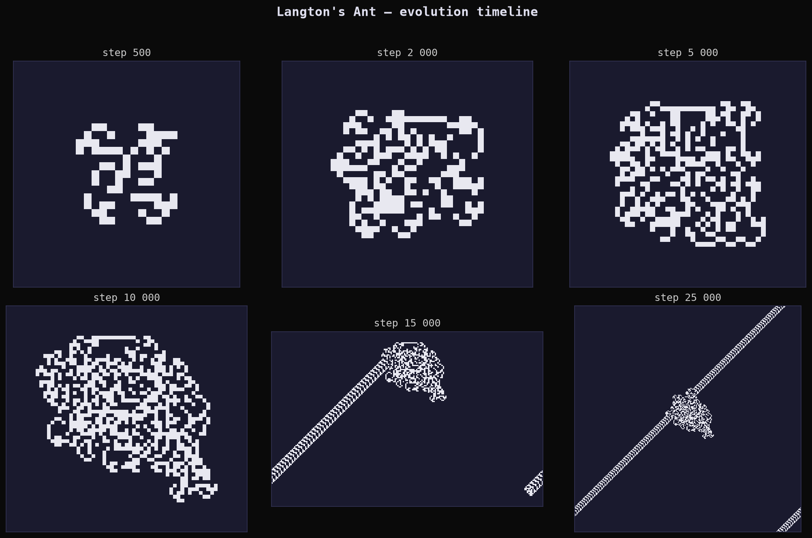
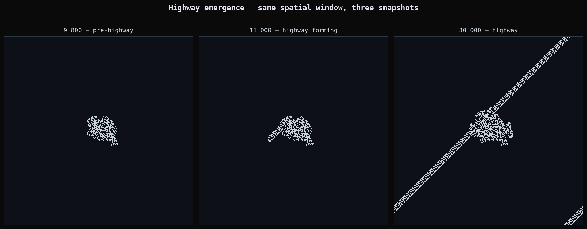
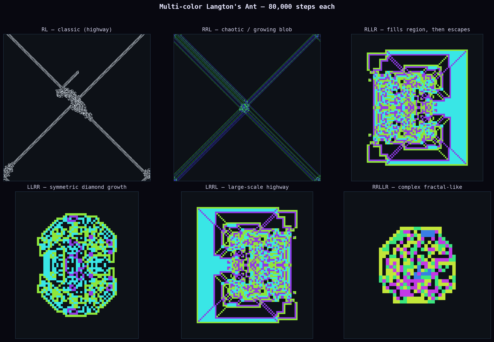
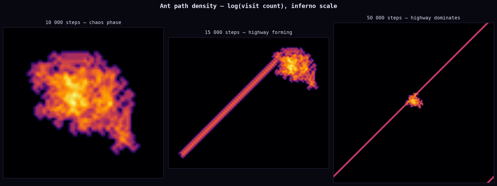
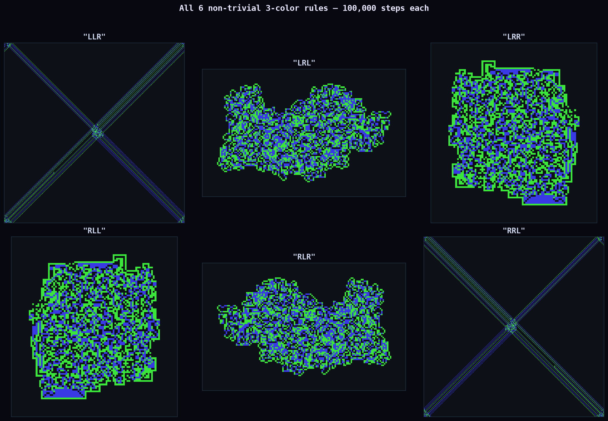
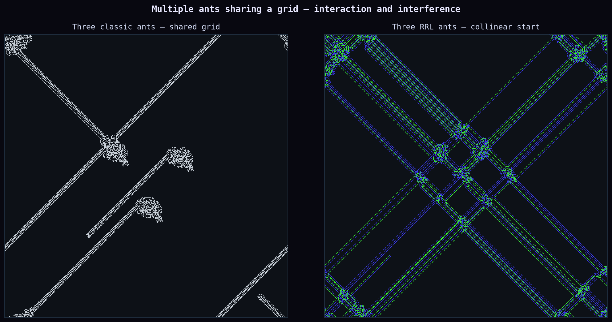

# 2026-06-30 — Langton's Ant

After a week of continuous fields and smooth gradients — reaction-diffusion PDEs,
complex function coloring — I wanted to spend today with something discrete and
combinatorial. Langton's Ant is a 2D Turing machine on an infinite grid, and it
is arguably the single most unsettling thing in elementary mathematics.

The rules take eleven words:

> White cell: turn right, flip to black, move forward.
> Black cell: turn left, flip to white, move forward.

That's it. Two states, two rules, one ant.

---

## The Thing That Happens

For the first few thousand steps the ant wanders with no apparent structure. The
pattern it leaves behind looks like noise — a shapeless dark smear on the grid. If
you ran it to 5,000 steps and showed someone the output, they would say "random walk."

Around step 10,000, something happens that has no satisfying explanation.

The ant starts building a **highway**: a periodic, diagonal, 104-step repeating
corridor that it extends forever. It never stops. The structure appears spontaneously,
without any change to the rules or the ant's state. No one has proved why it
happens — the conjecture that the highway *always* appears (for every possible finite
initial configuration, not just an empty grid) remains open.

The highway is not a coincidence. It has been verified for billions of steps. It
appears on grids with obstacles, with different initial configurations, with different
orientations. Something in the local dynamics of this 2-state system is pulling toward
it. We just don't know what.

---

## Figure 1 — Evolution timeline

Six snapshots of the classic 2-color ant (rule "RL") at 500, 2,000, 5,000, 10,000,
15,000, and 25,000 steps. All images are cropped to the bounding box of visited cells.

- **500 steps**: the ant has traced a rough blob. Some quasi-symmetric structure is
  visible near the center — the symmetry of the initial all-white grid hasn't fully
  broken yet.
- **2,000 steps**: the center has exploded outward. The boundary is irregular and
  roughly circular. No obvious structure.
- **5,000 steps**: the mass continues to grow. The interior looks mottled — cells
  have been flipped many times, leaving a salt-and-pepper texture.
- **10,000 steps**: almost exactly where the transition happens. In many runs the
  highway has just begun. You can sometimes spot the first diagonal streak at the
  edge of the blob.
- **15,000 steps**: the highway is visible as a diagonal protrusion extending from the
  main body. The "trunk" has stopped growing laterally and the ant is now committed.
- **25,000 steps**: the highway dominates. The main body is far to the lower-left;
  the diagonal corridor extends to the upper-right with the periodicity of a zipper.

---

## Figure 2 — Highway emergence

The same spatial window (the 30,000-step bounding box, padded and fixed) at three
moments: 9,800 steps, 11,000 steps, 30,000 steps. The ant's position isn't marked —
but you can infer it: it's at the growing tip of the highway.

The transition between the first and second panel is stark. At 9,800 the boundary
is ragged in all directions. At 11,000, a narrow diagonal tendril has emerged from
the upper-right corner of the blob and begun extending. By 30,000 the highway is
clearly the dominant structure — longer than the main body is wide.

What makes this disturbing is the *absence* of a trigger. The ant has no memory beyond
the current cell. The grid has no gradient, no attractor, no seed. The same physics
that produced the chaotic blob for 10,000 steps suddenly begins producing crystalline
periodicity. The only thing that changed is the exact configuration of black and white
cells under the ant's feet — a configuration that arose entirely from the ant's own
prior motion.

---

## Figure 3 — Multi-color variants

The classic ant uses 2 colors and a rule of length 2. The generalization: define a
rule string of any length *k*, using k colors (0 through k−1). On color *i*, turn
according to rule[i] (L or R), then advance the color to (i+1) mod k.

Six rules at 80,000 steps each:

- **RL** (classic): the highway we know.
- **RRL**: a chaotic blob. This rule doesn't produce a highway (at least not in
  80,000 steps). The three-color structure makes the interior richly textured —
  look at the density of the different-colored regions — but the boundary is still
  irregular.
- **RLLR**: the ant fills a region, escapes, and the pattern has a kind of bilateral
  structure. The four colors create vivid banding in the interior.
- **LLRR**: notable for its near-diamond symmetry. The two-left-two-right rule tends
  toward symmetric growth. The interior shows a layered pattern that recalls geological
  strata.
- **LRRL**: produces a large-scale highway, but a different one from the classic. The
  highway corridor is wider and the surrounding "tail" region has more structure than
  the classic two-color case. The four colors make the highway itself visibly
  multi-layered.
- **RRLLR**: the most complex pattern in this set. The five-color rule produces an
  irregular but large-scale structure that looks almost organic — branching, with
  no obvious symmetry axis.

The key observation: changing a single character in the rule string can qualitatively
change the long-term behavior. There's no simple mapping from rule → behavior class.

---

## Figure 4 — Path density

Instead of the cell state, this shows **how many times the ant visited each cell**,
rendered as log(visit count) on an inferno colormap (dark = rarely visited, bright =
frequently revisited).

- **10,000 steps**: the density map reveals internal structure that the state map
  obscures. The ant revisits the center region far more than the periphery — there's
  a bright core surrounded by rings of decreasing visitation. The chaos phase is
  not uniform: it's concentrated.
- **15,000 steps**: the highway begins to show as a bright diagonal streak extending
  from the upper-right of the central mass. The streak is narrow (the highway's
  periodicity is 104 steps wide, about 8 cells) but intensely bright because the
  ant traverses it repeatedly.
- **50,000 steps**: the highway streak now extends far beyond the central body. The
  core remains bright — the ant spent 10,000 steps there — but the highway streak
  is visibly brighter per unit length because the ant keeps returning to the same
  104-cell loop, over and over.

The transition from diffuse-cloud density to concentrated-streak density is the
same highway transition seen in the state maps, but from a different angle.

---

## Figure 5 — Complete 3-color rule survey

There are 2³ = 8 possible 3-color rules. Two are trivial: LLL (always turn left —
the ant traces a growing square spiral) and RRR (always turn right — same, mirrored).
The other six are shown here at 100,000 steps each.

- **LLR**: produces a roughly hexagonal blob with a subtle three-fold structure in the
  interior. Not a highway. Grows slowly.
- **LRL**: the most striking shape here — a structured blob that has a nearly
  rectangular outline with rounded corners. The interior shows diagonal banding.
- **LRR**: similar to LRL in overall shape but with different interior texture.
  The three colors produce visible layering.
- **RLL**: a classic highway-builder. The highway appears later than the 2-color case
  (my 100k step run shows it clearly — the diagonal tendril is unambiguous).
- **RLR**: the one that looks closest to the classic RL but with richer interior color
  structure. The highway is present and wide.
- **RRL**: a chaotic blob again. Some 3-color rules are highway-builders; others
  aren't. Which are which is not predictable from the rule string alone.

---

## Figure 6 — Multiple ants, shared grid

Two experiments with multiple ants sharing a single grid (all ants read and write
the same cell states):

**Left — three classic RL ants**: started at three positions forming a rough triangle,
60 pixels apart. For a long time, each ant behaves as if alone — building its own
chaotic blob. When the blobs meet, the ants begin interfering: each ant reads cells
that the other ants have flipped, disturbing both ants' dynamics. The result is a
merged structure that looks nothing like any single ant's pattern. Symmetry is broken
by the timing of the first collision.

**Right — three RRL ants, collinear**: started in a horizontal line, 80 pixels apart.
The symmetric starting configuration produces a roughly bilateral final pattern —
but only roughly, because the ants' highways (if any) will eventually break the
bilateral symmetry when one ant begins building in a direction that differs from the
others.

The shared-grid experiment raises a question that's harder than the single-ant case:
does a highway *always* eventually emerge in a multi-ant system? Almost certainly not,
since ants can disrupt each other's highway-building. Whether multi-ant systems have
any guaranteed long-term regularity is entirely open.

---

## What I Was Thinking About

The highway is one of those results that feels like it shouldn't be true. You look at
the rules and think: this is a random walk with a bias. It should diffuse. Maybe it
forms a rough blob with some internal structure. But a *periodic crystal*, self-assembled
from an empty grid, using nothing but the ant's own prior footsteps? That's not what
the rules say should happen.

And yet it does. Every time.

The closest analogy I can find in the earlier work here is the Turing instability in
Gray-Scott reaction-diffusion: a spatially uniform steady state that is stable to small
perturbations in time but *unstable* to small perturbations in space, so any small
spatial heterogeneity grows into macroscopic pattern. The highway feels structurally
similar — the chaotic phase generates heterogeneous local configurations until,
eventually, one configuration acts as a seed for the periodic highway mode, which then
outcompetes the chaotic mode by being reinforced by each successive visit.

But that's a hand-wave, not a proof. The highway remains unproved. Nobody knows.
That's why I spent the day with it.
