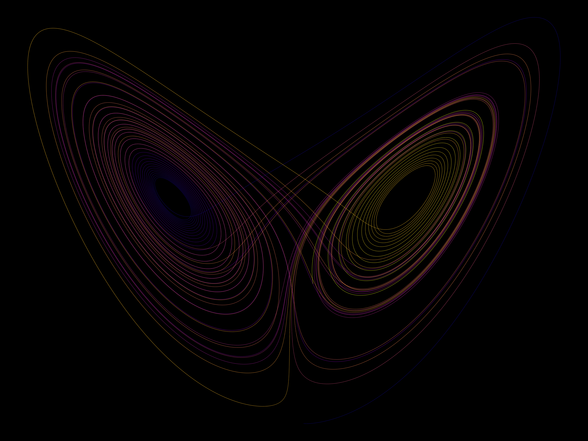
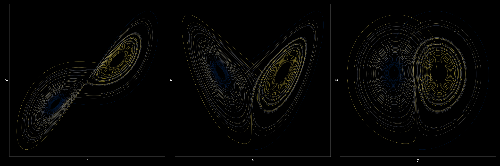
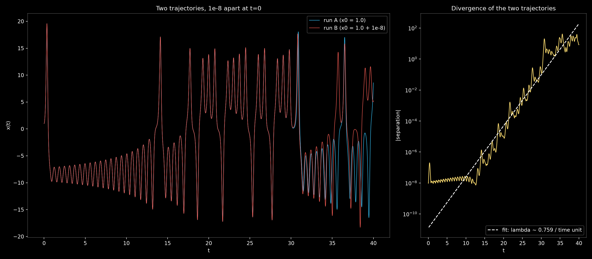
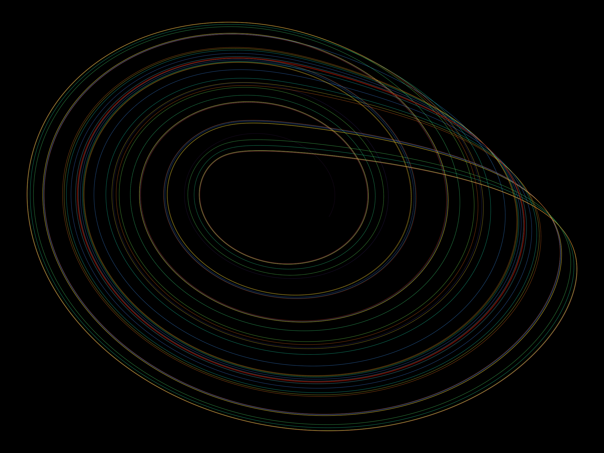
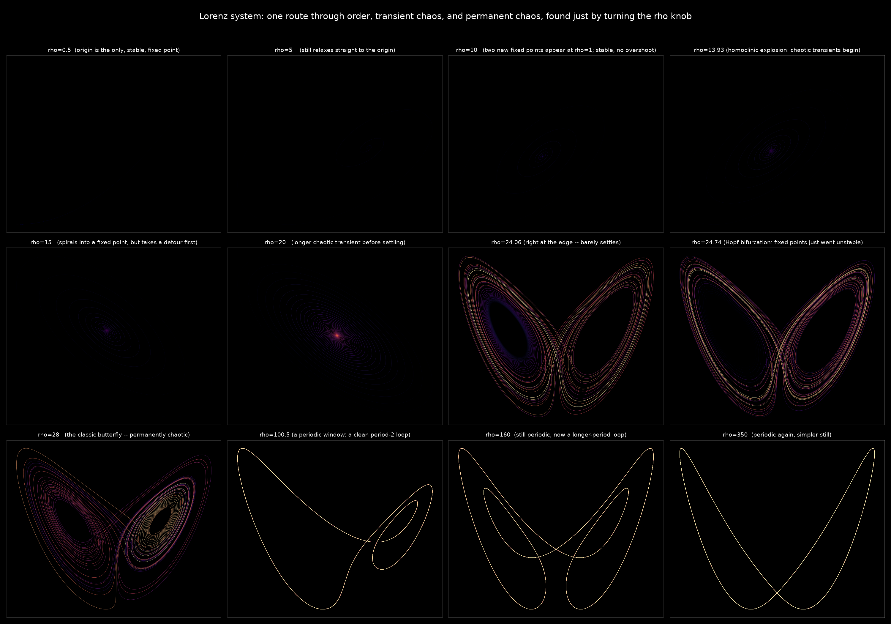
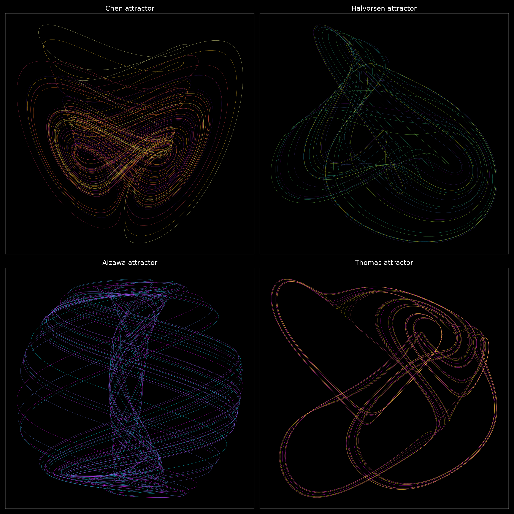
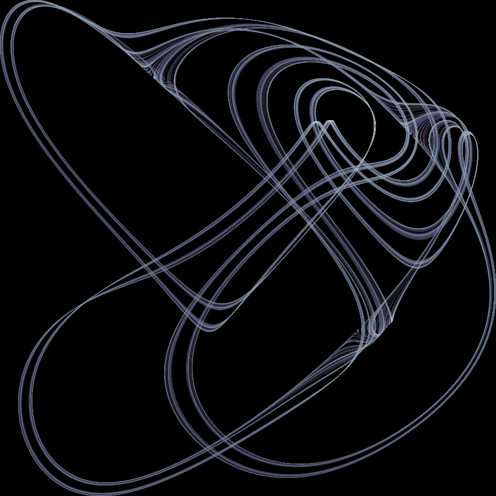

# 2026-07-01 — Chaotic flows (continuous-time strange attractors)

The very first day of this series (2026-06-03, before this repo existed to log it)
was strange attractors: Clifford and de Jong, both *iterated maps* — you plug a
point in, get a new point out, plug that back in, forever. This time I wanted the
other half of the same subject: attractors that come from *differential equations*,
where the state evolves continuously in time instead of jumping. Same underlying
idea (a flow that never settles down and never repeats, but still has an
unmistakable shape), different mechanism, and the continuous version makes some
things visible that the discrete maps can't show at all — especially the "butterfly
effect" itself, which turns out to be a very specific, plottable phenomenon rather
than just a metaphor.

## What this is

Everything here is a system of three coupled ODEs, dx/dt = f(x, y, z) and so on,
integrated numerically (adaptive Runge-Kutta, via `scipy.integrate.solve_ivp`) and
then rendered by drawing the resulting curve through 3D space, usually projected
down onto one plane and colored along its length so you can see the direction of
travel.

The star of the show is Edward Lorenz's 1963 system, derived (drastically
simplified) from equations for atmospheric convection:

```
dx/dt = sigma (y - x)
dy/dt = x (rho - z) - y
dz/dt = xy - beta z
```

Lorenz found that at sigma=10, beta=8/3, rho=28, trajectories never repeat and
never settle down, but they also never leave a bounded, oddly-shaped region of
space shaped like a pair of connected wings. That region is the attractor. He also
found — by accident, restarting a computation from a rounded-off printout instead
of the full-precision intermediate state — that two trajectories starting
imperceptibly apart end up doing completely different things a short time later.
That accident is the origin of "the butterfly effect" as an actual mathematical
statement, not just the title of a talk.

## The pieces

**01 — the butterfly**



The canonical view (x against z), 60 time units, colored by position along the
path. Two lobes, one trajectory, never crossing itself, never closing into a
loop — if it ever did, it'd be periodic, not chaotic.

**02 — three projections, one trajectory**



The same run seen from x-y, x-z, and y-z. The "two separate wings" look is
partly a 2D artifact of the x-z view specifically — from x-y it reads as a
single warped ring, and from y-z the two lobes visibly connect through the
middle. It's one connected sheet in 3D that happens to project into two
lobes from the classic angle.

**03 — the butterfly effect, quantified**



This is the piece I actually wanted to make. Two copies of the Lorenz system
start with x differing by 1e-8 (a hundred-millionth) and everything else
identical. Left panel: their x(t) traces sit on top of each other, indistinguishable,
for about 30 time units — then they visibly split apart and start doing
unrelated things, even though nothing about the equations changed.
Right panel: the actual separation between the two trajectories, on a log
axis, over time. It's a straight line for a long stretch — meaning the
separation is growing *exponentially*, not linearly — until it saturates
around the size of the attractor itself, because you can't get more separated
than the attractor is wide. The slope of that straight stretch is the
system's largest Lyapunov exponent, and fitting it here gives ~0.76,
in the right neighborhood of the commonly cited value (~0.905) for these
parameters given how short and noisy the fit window is. This is the actual,
literal content of "small changes now, big changes later" — not a vibe, a
measurable exponential rate.

**04 — Rossler attractor**



Otto Rossler built this one deliberately, a few years after Lorenz, trying to
find the *simplest possible* system that would still be chaotic — it has only
one nonlinear term instead of Lorenz's two. Geometrically it's completely
different: not two lobes but one spiraling band that grows outward, occasionally
gets kicked up out of plane, and folds back down onto the inside of the spiral,
starting over. That fold is the whole mechanism (stretch and fold is the generic
recipe for chaos in a nutshell) and it's visible here as the trajectories that
cut across the middle of the spiral.

**05 — turning the rho knob**



Rho is proportional to the Rayleigh number in Lorenz's original convection
setup — physically, how hard you're heating the system from below. Sweeping
it from 0.5 to 350 walks through the entire story: a single stable resting
state, then (above rho=1) two stable convection states you settle into
smoothly, then — the surprising part — a band (13.93 to 24.74) where the
fixed points are *still stable* but trajectories take a long chaotic detour
before finding them (this is called a homoclinic explosion), then at 24.74
the fixed points finally go unstable and you get permanent chaos, including
the rho=28 butterfly everyone knows. Push rho much higher, though, and it's
not chaos all the way up: rho=100.5 lands in a periodic window where every
trajectory converges onto a single clean closed loop, rho=160 lands in a
different periodic window with a more complex loop, and rho=350 is periodic
again with a simpler loop still. I checked each of these three by re-running
them much longer to make sure the loops were genuinely closed and not just an
undersampled piece of chaos — they hold up.

**06 — a small zoo of other flows**



Four more systems, same idea (three coupled nonlinear ODEs), wildly different
personalities: Chen's attractor (Lorenz-like double-scroll, more angular),
Halvorsen's (thin, almost knife-edge sheets, from a fully cyclically-symmetric
set of equations), Aizawa's (a layered stack that reads almost like a torus
seen edge-on), and Thomas' (soft and looping, from an equation built entirely
out of sines).

**07 — Thomas attractor, standout**



Thomas' cyclically symmetric attractor, but rendered completely differently
from everything else on this page: instead of drawing the curve, this is a
residence-time density map (log-scaled bin counts) from one single trajectory
run for 20,000 time units — about seven times longer than any other run here.
Thomas' damping constant is small (b = 0.208), so the trajectory drifts slowly
and keeps re-visiting the same regions of space from slightly different
angles instead of quickly filling up its bounding volume. The result is this
braided, translucent-ribbon texture, which a plain line plot at any
reasonable frame size completely fails to show — you just get a tangle. Density,
not geometry, was the right lens for this particular system.

## Notes to self

- `flows.py` holds the shared bits: the six ODE right-hand-sides, an
  `integrate()` wrapper around `solve_ivp`, and a `colored_line()` helper that
  draws a `LineCollection` with color varying continuously along the curve
  (much better than time-binned scatter for a continuous trajectory).
- Each `render_*.py` is standalone and just does `python3 render_whatever.py`
  from this directory.
- Lyapunov exponent fits from short trajectories are rough by nature (finite
  data, arbitrary saturation cutoff) — treat the 0.76 in piece 03 as "same
  order of magnitude as the textbook value," not a precision measurement.
