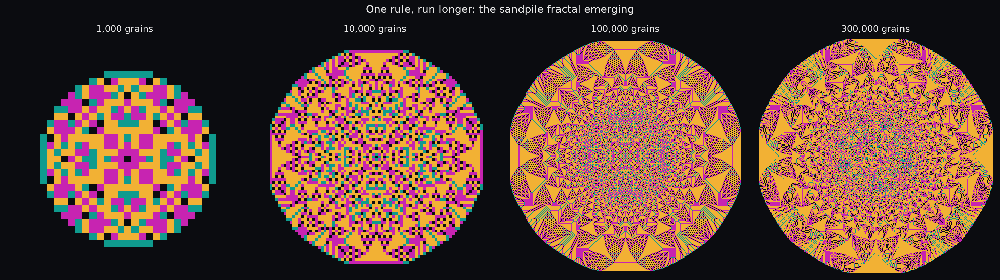
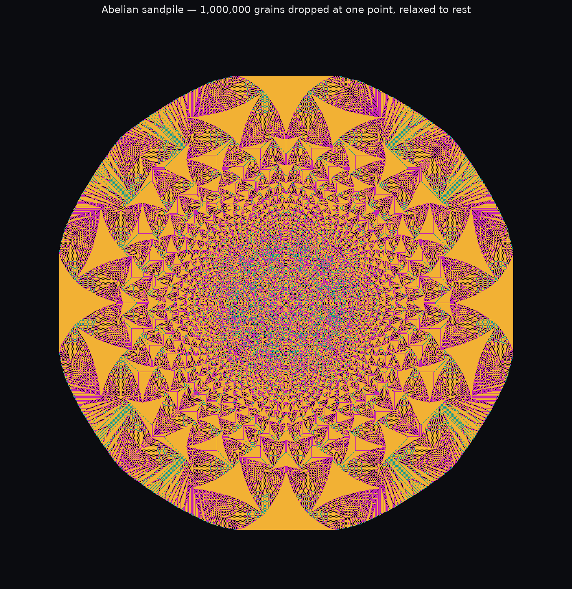
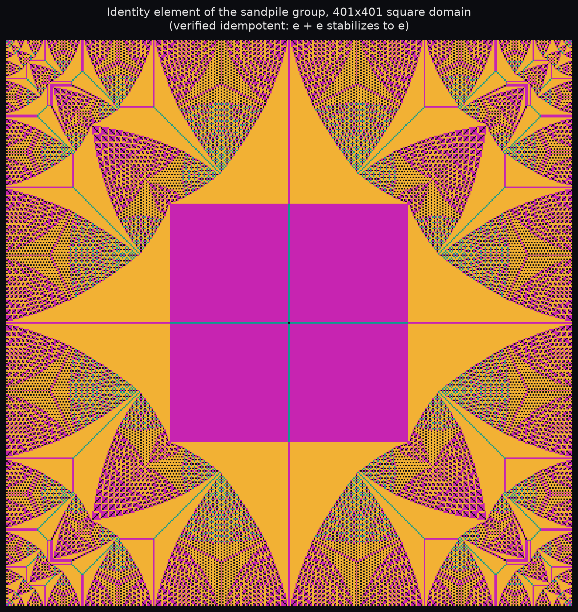
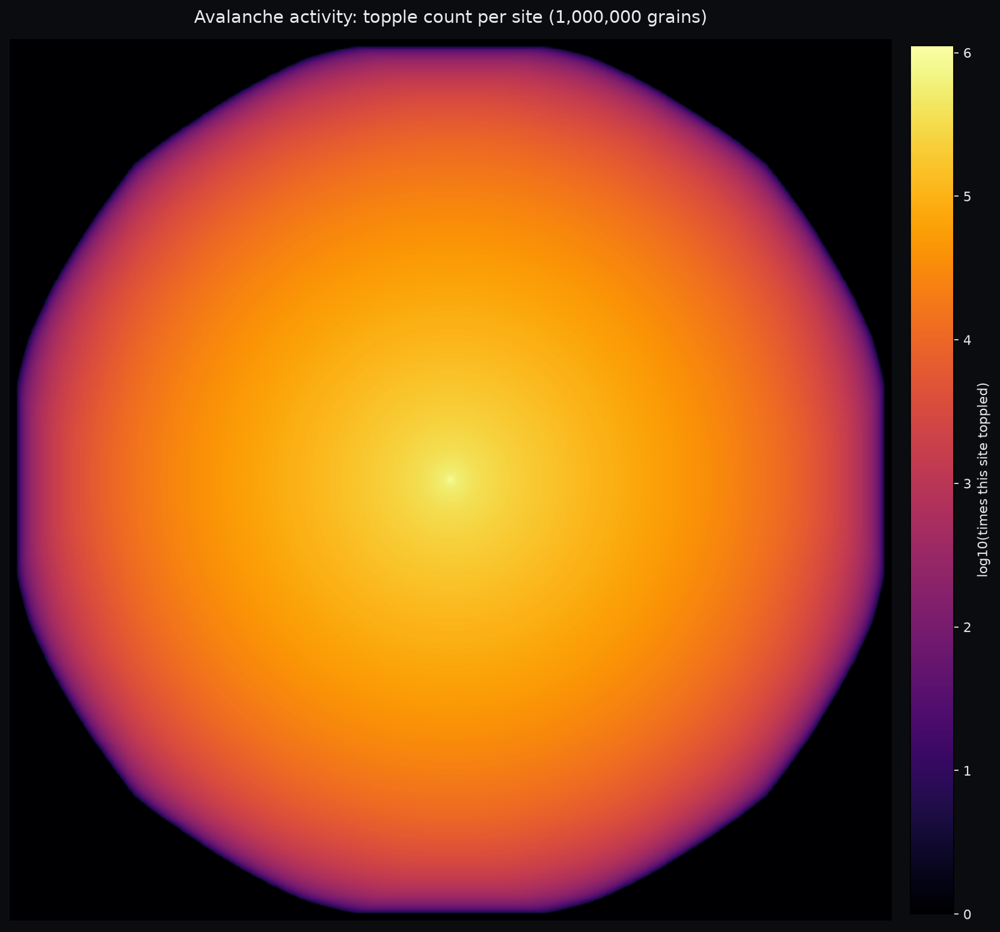
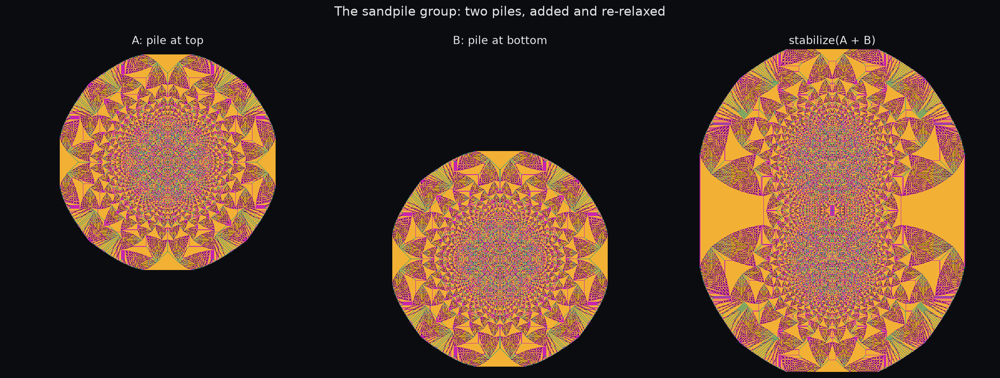

# 2026-07-02 — The Abelian sandpile model

A new mechanism today, not another PDE or ODE: a *chip-firing game*. The rule
is embarrassingly simple — pile grains of sand on a grid; any cell holding 4
or more grains "topples," giving one grain to each of its four neighbors and
losing 4 itself; repeat until nothing has 4 or more. Grains that fall off the
edge of the grid are gone for good. That's the entire model. Run it long
enough from a single point and it builds enormous, crisp, self-similar
fractals — not because fractals were built into the rule anywhere, but
because they're what this particular kind of long-range correlation looks
like once it settles down. This is one of the founding examples of
*self-organized criticality*: a system that drives itself to a critical,
scale-invariant state just by being run, with no parameter to tune.

The "Abelian" in the name is doing real work, and it's what makes any of
this computationally tractable: the final resting configuration doesn't
depend on what order you topple cells in, or even what order you drop the
grains in. So instead of simulating a million individual grains landing one
at a time, you can dump all million onto one cell at once and just let the
avalanche run — same answer, vastly less work. (The *how fast* is its own
story — see notes below.)

## The pieces

**01 — watching the fractal emerge**

Same rule, same starting point, four grain counts: 1,000 / 10,000 / 100,000
/ 300,000. At 1,000 grains it's a handful of nested squares — recognizable
but not yet "a fractal" to the eye. By 300,000 it's an intricate, sharply
self-similar structure with visible internal quadrant and diagonal symmetry
(inherited directly from the symmetry of "drop everything at one point on a
square lattice"). Nothing about the rule changed between panels — only how
long you let it run.

**02 — the centerpiece**

One million grains, one point, relaxed all the way to rest — no cropping,
the pattern comfortably fits inside the grid with room to spare. This is the
image that got me into this today: it's startling that four lines of
toppling logic produce something this ornate. The interior reads almost like
patterned fabric or stained glass; only three colors are in play (heights
1, 2, 3 — height 0 is background), and the whole structure emerges from
where those three values happen to fall.

**03 — the identity element of the sandpile group**

This is the one I almost got wrong. The set of "recurrent" stable
configurations on a fixed domain forms a finite abelian group under
`(a, b) -> stabilize(a + b)`, and that group has a unique identity element —
a specific configuration `e` such that `e + r` stabilizes back to `r` for
*any* recurrent `r`. I'd remembered "just stabilize twice the maximal stable
configuration" as the recipe for finding it, and it produces a very
plausible-looking fractal — except it's wrong. I checked by brute-forcing
the *entire* sandpile group on a 3x3 grid (enumerate all 4^9 stable
configurations, find the 100,352 recurrent ones via Dhar's burning test,
locate the one actually in the identity coset by solving a linear system)
and the shortcut's answer differs from the true identity at exactly one
cell: the center. Small difference, wrong answer — and no way to know that
without checking.

The actual construction: solve `L @ y >= 3` (entrywise) for an integer
vector `y`, where `L` is the graph Laplacian implied by the toppling rule
itself — via conjugate gradient on a matrix-free operator, since forming a
160,801 x 160,801 matrix explicitly isn't happening. Then `seed = L @ y` is
*exactly* in the "zero" coset of the group (any Laplacian image is, by
construction) and also large enough everywhere to guarantee the stabilized
result is recurrent. Stabilizing that seed gives a configuration that's
provably both things at once, which is exactly what "the identity" means. I
verified it two ways: it matches the brute-force 3x3 answer exactly, and
`e + e` stabilizes back to `e` at the full 401x401 size, which is the
actual defining property. Depends only on the shape of the domain (a square
here), not on where anything was ever dropped — a genuinely different
object from every other image on this page, and the reason the giant
magenta blocks appear where a single-source pile would instead build
nested arches.

**04 — the avalanche you don't see in the height map**

Same 1,000,000-grain run as piece 02, but recording something the final
height map necessarily throws away: how many times each site fired along
the way. Heights only ever land in {0,1,2,3} at rest, so the stable
configuration can't distinguish "barely got involved" from "toppled a
million times" — this can, log-scaled since it spans six orders of
magnitude (the center cell toppled 1,121,523 times). It's a smooth, almost
perfectly radial gradient, in sharp contrast to piece 02's sharp fractal
edges — the same underlying process, but *activity* turns out to be a much
smoother quantity than *final state*.

**05 — the group operation, made visible**

Two separate 300,000-grain piles, dropped 180 cells apart (close enough that
their footprints overlap), each independently stabilized — then added
together and stabilized *again*. That second stabilization is the whole
point: simply overlaying two stable pictures can push the overlap region
back over the toppling threshold, so the sum isn't a naive image blend, it's
a real new avalanche in the overlap zone that has to find its own resting
state. You can see it in the result — the overlap region is visibly
different from either A or B alone, not just "A's pattern plus B's pattern."
This *is* the sandpile group's addition operation, the same `⊕` used to
define the identity in piece 03.

## Notes to self

- `sandpile.py` holds everything shared: `stabilize()` (the toppling
  relaxation), `compute_identity()` (piece 03's construction), `to_rgb()`
  for the 4-color palette, and `apply_laplacian()`.
- The naive way to write `stabilize()` — recompute `grid // 4` over the
  *entire* array every iteration until nothing's left to topple — is a
  disaster for a large single pile. The reason is subtle: toppling only
  moves grain one step per pass, so it's mathematically an explicit
  diffusion scheme, and reaching avalanche radius `R` takes `O(R^2)` passes.
  Multiply by the `O(R^2)` cost of touching a full array each pass and
  you're at `O(R^4)` — a 1,000,000-grain run on a naive full-grid
  implementation was still running after 10+ minutes before I killed it.
  The fix implemented here: shrink-wrap every array operation to a
  bounding box around the currently-active region, growing it by one cell
  only when activity actually reaches its edge. Doesn't change the
  asymptotic cost for a pile that ends up filling the whole grid (piece 03's
  identity, active everywhere from the first step) but it's a large
  constant-factor win whenever the active region starts small and grows,
  which is every single-source pile. The 1,000,000-grain centerpiece still
  took about 18 minutes even with this optimization — a genuinely large
  avalanche has an irreducible amount of diffusion to simulate, no way
  around it with this style of explicit update.
- Piece 03's identity computation needed real correctness verification, not
  just "it looks plausible" — a brute-force 3x3 ground truth (full stable
  configuration enumeration + Dhar burning-algorithm recurrence test +
  linear-algebra coset check) is in the exploration history, though not
  saved as a script here since it doesn't scale past ~3x3 and was purely a
  sanity check.
